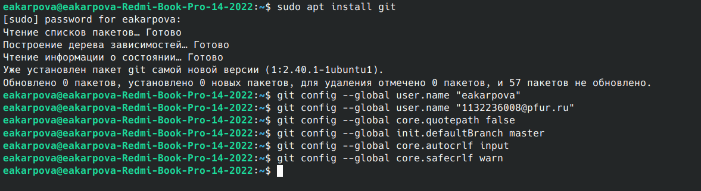
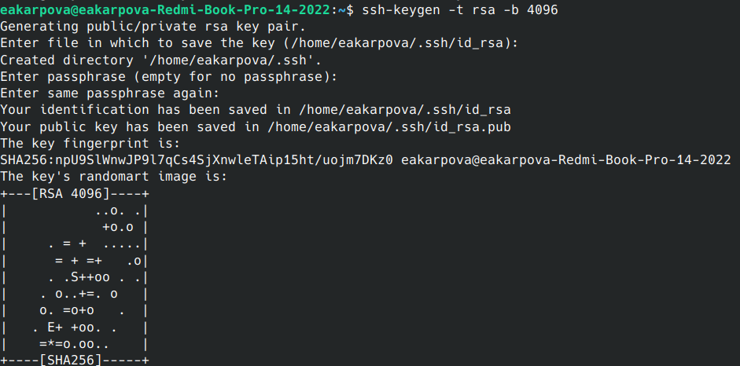
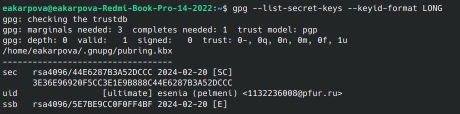
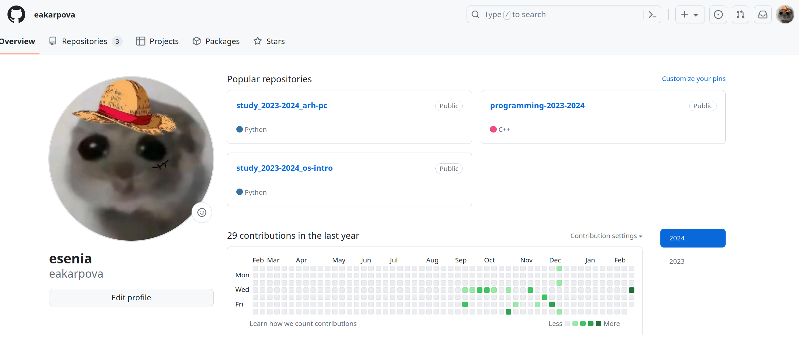
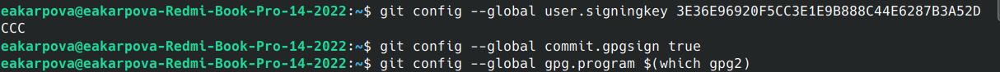
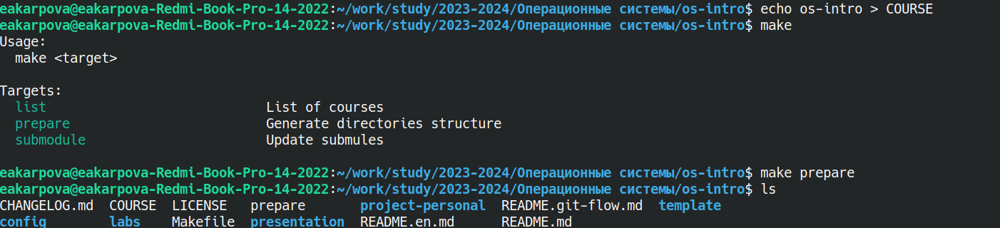

---
## Front matter
lang: ru-RU
title: Лабораторная работа №2.
subtitle: Первоначальна настройка git
author:
  - Карпова Е.А.
institute:
  - Российский университет дружбы народов, Москва, Россия
date: 23 февраля 2024

## i18n babel
babel-lang: russian
babel-otherlangs: english

## Formatting pdf
toc: false
toc-title: Содержание
slide_level: 2
aspectratio: 169
section-titles: true
theme: metropolis
header-includes:
 - \metroset{progressbar=frametitle,sectionpage=progressbar,numbering=fraction}
 - '\makeatletter'
 - '\beamer@ignorenonframefalse'
 - '\makeatother'
---

# Информация

## Докладчик

:::::::::::::: {.columns align=center}
::: {.column width="70%"}

  * Карпова Есения Алексеевна
  * студентка НКАбд-02-23
  * ФФМиЕН
  * Российский университет дружбы народов
  * [1132236008@pfur.ru](mailto:1132236008@pfur.ru)
  * <https://github.com/eakarpova>

:::
::: {.column width="30%"}

:::
::::::::::::::

# Вводная часть

## Актуальность

- Системы контроля версий применяются при работе нескольких человек над одним проектом
- GitHub — крупнейший веб-сервис для хостинга IT-проектов и их совместной разработки

- Для успешной работы в IT индустрии важно уметь работать в GitHub

## Объект и предмет исследования

- SSH и PGP ключи
- Система контроля версий git
- Сервис GitHub

## Цели и задачи

- Цель

1. Применение средств контроля версий,
2. Своение навыка по работе с git.

- Задания

1. Создать базовую конфигурацию для работы с git
2. Создать ключ SSH
3. Создать ключ PGP
4. Зарегистрироваться на Github
5. Настроить подписи git
6. Создать локальный каталог для выполнения заданий по предмету

## Материалы и методы

- Лабораторная работа №2 - ТУИС
- Основные команды git
- Верификация коммитов с помощью PGP
- Метод подписывание коммитов git

# Выполнение лабораторной работы

## Создание базовой конфигурации для работы с git

- Git- распределённая система управления версиями

## Создание ключа SSH

- SSH — сетевой протокол прикладного уровня
- Алгоритм: rsa с ключём размером 4096 бит

## Создание ключа PGP

- PGP —  библиотека функций, позволяющая выполнять операции шифрования
- Выбранные опции:
  1)тип RSA
  2)размер 4096
  3)0
  4)Имя
  5)Адрес электронной почты

## Регистрация на Github

## Настройка подписей git

## Создание локального каталога для выполнения заданий по предмету

# Результаты

- Узнала о применении средств контроля версий
- Освоила умения по работе с git.

