---
## Front matter
title: "Лабораторная работа №2"
subtitle: "Первоначальная настройка git"
author: "Карпова Есения Алексеевна"

## Generic otions
lang: ru-RU
toc-title: "Содержание"

## Bibliography
bibliography: bib/cite.bib
csl: pandoc/csl/gost-r-7-0-5-2008-numeric.csl

## Pdf output format
toc: true # Table of contents
toc-depth: 2
lof: true # List of figures
lot: true # List of tables
fontsize: 12pt
linestretch: 1.5
papersize: a4
documentclass: scrreprt
## I18n polyglossia
polyglossia-lang:
  name: russian
  options:
	- spelling=modern
	- babelshorthands=true
polyglossia-otherlangs:
  name: english
## I18n babel
babel-lang: russian
babel-otherlangs: english
## Fonts
mainfont: PT Serif
romanfont: PT Serif
sansfont: PT Sans
monofont: PT Mono
mainfontoptions: Ligatures=TeX
romanfontoptions: Ligatures=TeX
sansfontoptions: Ligatures=TeX,Scale=MatchLowercase
monofontoptions: Scale=MatchLowercase,Scale=0.9
## Biblatex
biblatex: true
biblio-style: "gost-numeric"
biblatexoptions:
  - parentracker=true
  - backend=biber
  - hyperref=auto
  - language=auto
  - autolang=other*
  - citestyle=gost-numeric
## Pandoc-crossref LaTeX customization
figureTitle: "Рис."
tableTitle: "Таблица"
listingTitle: "Листинг"
lofTitle: "Список иллюстраций"
lotTitle: "Список таблиц"
lolTitle: "Листинги"
## Misc options
indent: true
header-includes:
  - \usepackage{indentfirst}
  - \usepackage{float} # keep figures where there are in the text
  - \floatplacement{figure}{H} # keep figures where there are in the text
---

# Цель работы

Цель данной лабораторной работы - это изучение идеологии и применение средств контроля версий, а также освоение навыка по работе с git.

# Задания

1. Создать базовую конфигурацию для работы с git
2. Создать ключ SSH
3. Создать ключ PGP
4. Зарегистрироваться на Github
5. Настроить подписи git
6. Создать локальный каталог для выполнения заданий по предмету

# Теоретическое введение

Системы контроля версий (Version Control System, VCS) применяются при работе нескольких человек над одним проектом. Система контроля версий Git представляет собой набор программ командной строки. Доступ к ним можно получить из терминала посредством ввода команды git с различными опциями.
Основные команды git:
  git pull - получение обновлений (изменений) текущего дерева из центрального репозитория:
  git push - отправка всех произведённых изменений локального дерева в центральный репозиторий
  git add . - добавить все изменённые и/или созданные файлы и/или каталоги
  git commit -am 'commit'- сохранить все добавленные изменения и все изменённые файлы

Работа с локальным репозиторием
1)Создадим локальный репозиторий.
2)Сначала сделаем предварительную конфигурацию, указав имя и email владельца репозитория:
  git config --global user.name "Имя Фамилия"
  git config --global  user.email "work@mail"
3)Создадим тестовый текстовый файл hello.txt и добавим его в локальный репозиторий:
  echo 'hello world' > hello.txt
  git add hello.txt
  git commit -am 'Новый файл'

Создание ключа ssh
1)Аутентификация
2)Симметричные шифры
3)Обмен ключами
Ключ ssh создаётся командой:
  ssh-keygen -t <алгоритм>

Верификация коммитов с помощью PGP
Генерируем ключ
  gpg --full-generate-key
Из предложенных опций выбираем:
  тип RSA and RSA;
  размер 4096;
  выберите срок действия; значение по умолчанию — 0 (срок действия не истекает никогда).
GPG запросит личную информацию, которая сохранится в ключе:
  Имя (не менее 5 символов).
  Адрес электронной почты.
  При вводе email убедитесь, что он соответствует адресу, используемому на GitHub.
  Комментарий. Можно ввести что угодно или нажать клавишу ввода, чтобы оставить это поле пустым.

Подписывание коммитов git
Подпись коммитов при работе через терминал:
  git commit -a -S -m 'your commit message'

# Выполнение лабораторной работы

1. Создание базовой конфигурации для работы с git.

Для того, чтобы установить git воспользуемся командой
  sudo apt install
В рамках базовой настройки git зададим имя и email владельца репозитория и настроим utf-8 в выводе сообщений git
После этого зададим имя начальной ветки, параметр autocrlf и параметр safecrlf (рис. [-@fig:001]).

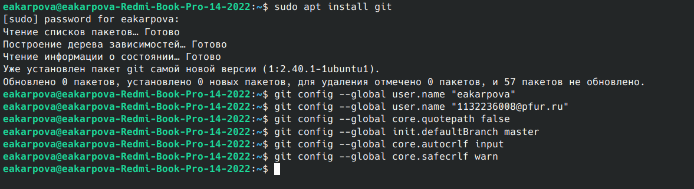{#fig:001 width=100%}

Установим gh для дальнейшей удаленной работы с репозиторием (рис. [-@fig:002]).

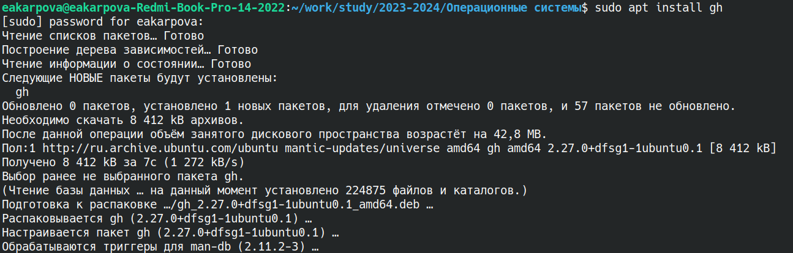{#fig:002 width=100%}

2. Создание ключа SSH

Создадим ключ SSH по алгоритму rsa с ключом размером 4096 бит (рис. [-@fig:003]).

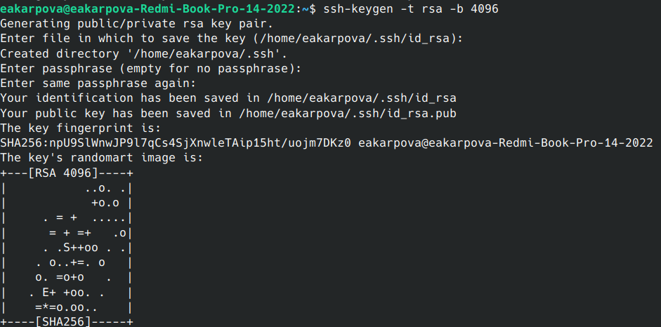{#fig:003 width=100%}

3. Создание ключа PGP

Сгенерируем ключ PGP:
Вводим команду и из предложенных опций выберем тип RSA and RSA,
размер 4096, срок действия - 0
Вводим личную информацию - имя и адрес электронной почты (рис. [-@fig:004]).

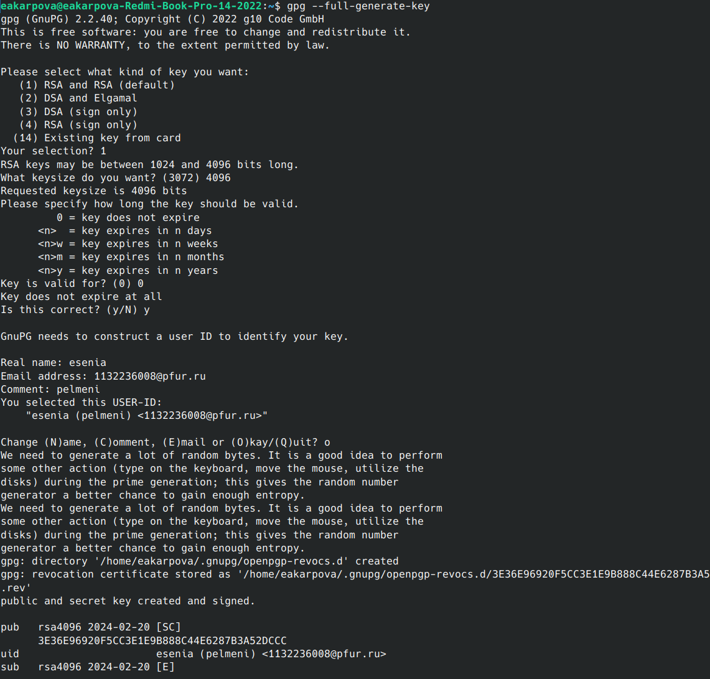{#fig:004 width=100%}
4. Регистрация на Github

Так как у меня уже есть учетная запись на github, я опущу описание первичной настройки и перейду к добавлению ключа PGP в GitHub:
вводим список ключей и копируем отпечаток приватного ключа (последовательность байтов, используемая для идентификации более длинного, по сравнению с самим отпечатком ключа) (рис. [-@fig:005]).

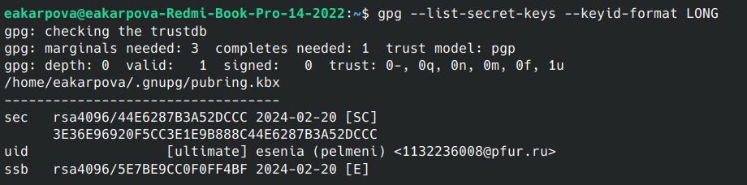{#fig:005 width=100%}

Скопируем сгенерированный ключ в буфер обмена(рис. [-@fig:006]).

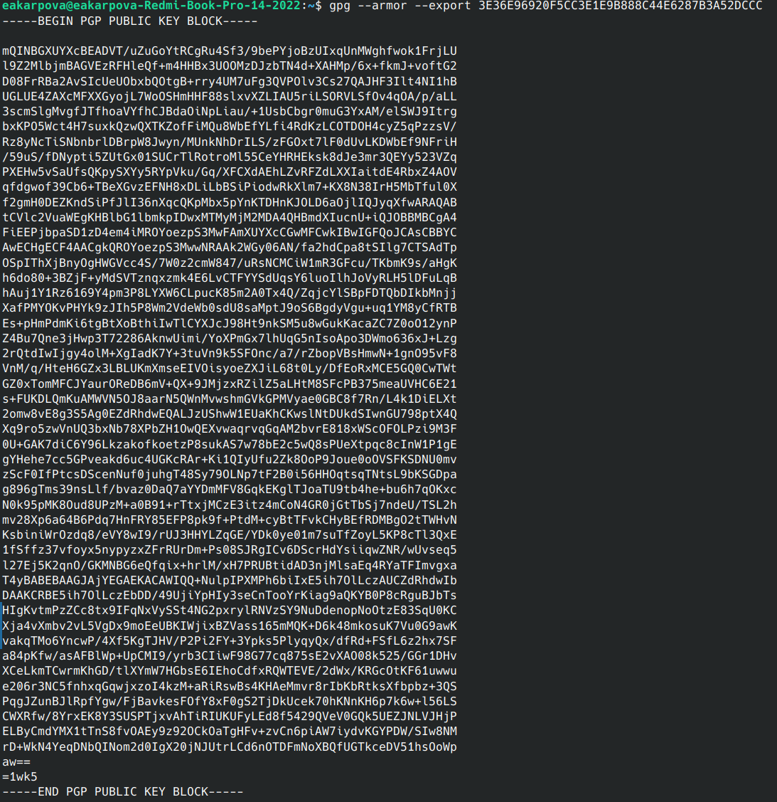{#fig:006 width=100%}

После этого перейдем в настройки GitHub и с помощью кнопки New GPG key вставим полученный ключ в поле ввода(рис. [-@fig:007]).

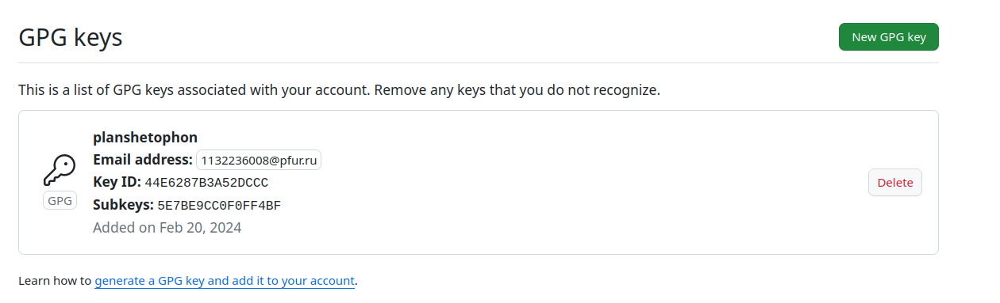{#fig:007 width=100%}

5. Настройка подписей git

Используя введёный email, укажим Git применять его при подписи коммитов:
(рис. [-@fig:008]).

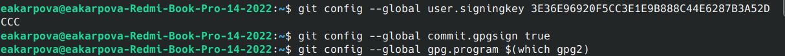{#fig:008 width=100%}

6. Создание локального каталога для выполнения заданий по предмету

Настроим gh и с его помощью создадим шаблон для рабочего пространства (рис. [-@fig:009]).

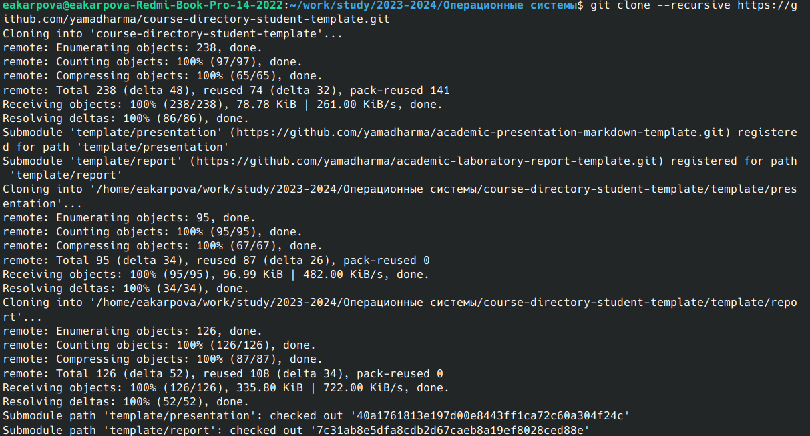{#fig:009 width=100%}

Перейдем в каталог курса, удалим лишние файлы и создадим необходимые каталоги(рис. [-@fig:010]).

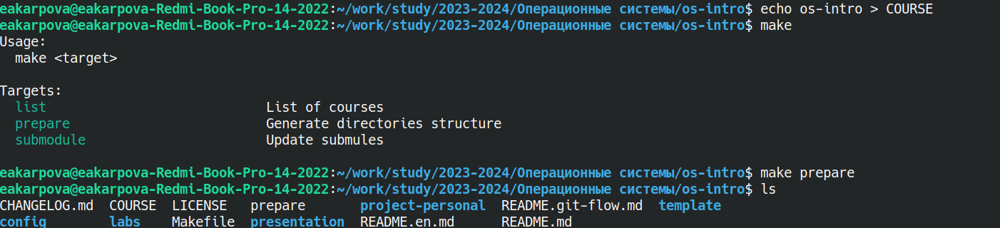{#fig:010 width=100%}

Выберем все файлы и сохраним изменения (рис. [-@fig:011]).

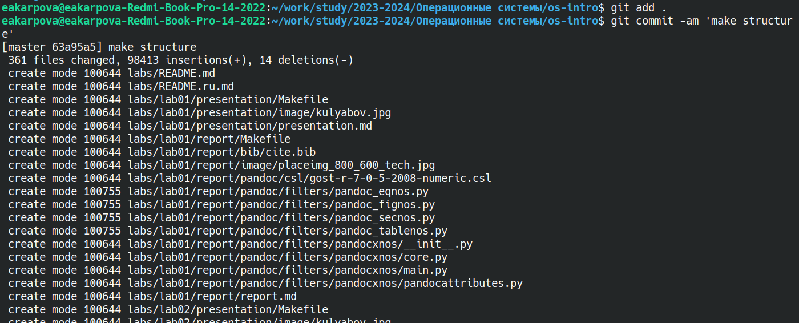{#fig:011 width=100%}

Отправим файлы на сервер (рис. [-@fig:012]).

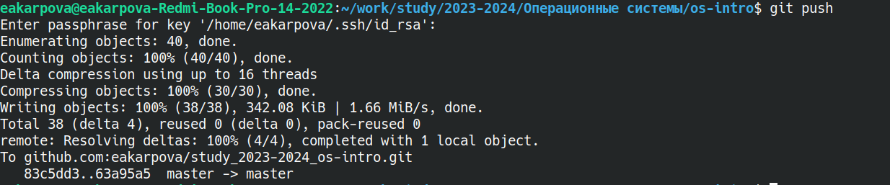{#fig:012 width=100%}

# Выводы

С помощью данной лабораторной работы я изучила идеологию и применение средств контроля версий, а также освоила умения по работе с git.

# Ответ на контрольные вопросы

1. Системы контроля версий (VCS) - программное обеспечение для облегчения работы с изменяющейся информацией.
Они позволяют хранить несколько версий изменяющейся информации,
одного и того же документа, может предоставить доступ к более ранним версиям документа.
Используется для работы нескольких человек над проектом, позволяет посмотреть, кто и
когда внес какое-либо изменение и т. д. VCS ррименяются для: Хранения понлой истории изменений,
сохранения причин всех изменений, поиска причин изменений и совершивших изменение, совместной работы над проектами.

2. Хранилище -- репозиторий, хранилище версий, в нем хранятся все документы, включая историю их изменения и прочей служебной информацией.
commit -- отслеживание изменений, сохраняет разницу в изменениях.
История -- хранит все изменения в проекте и позволяет при необходимости вернуться/обратиться к нужным данным.
Рабочая копия -- копия проекта, основанная на версии из хранилища, чаще всего последней версии.

3. Централизованные VCS (например: CVS, TFS, AccuRev) -- одно основное хранилище всего проекта. Каждый пользователь копирует себе
необходимые ему файлы из этого репозитория, изменяет, затем добавляет изменения обратно в хранилище. Децентрализованные
VCS (например: Git, Bazaar) -- у каждого пользователя свой вариант репозитория (возможно несколько вариантов), есть возможность добавлять
и забирать изменения из любого репозитория. В отличие от классических, в распределенных (децентралиованных)
системах контроля версий центральный репозиторий не является обязательным.

4. Сначала создается и подключается удаленный репозиторий, затем по мере изменения проекта эти изменения отправляются на сервер.

5. Участник проекта перед началом работы получает нужную ему версию проекта в хранилище, с помощью определенных команд, после внесения изменений пользователь размещает новую версию в хранилище. При этом предыдущие версии не удаляются. К ним можно вернуться в любой момент.

6. Хранение информации о всех изменениях в вашем коде, обеспечение удобства командной работы над кодом.

7. Создание основного дерева репозитория: git init

Получение обновлений (изменений) текущего дерева из центрального репозитория: git pull

Отправка всех произведённых изменений локального дерева в центральный репозиторий: git push

Просмотр списка изменённых файлов в текущей директории: git status

Просмотр текущих изменений: git diff

Сохранение текущих изменений: добавить все изменённые и/или созданные файлы и/или каталоги: git add .

добавить конкретные изменённые и/или созданные файлы и/или каталоги: git add имена_файлов

удалить файл и/или каталог из индекса репозитория (при этом файл и/или каталог остаётся в локальной директории): git rm имена_файлов

Сохранение добавленных изменений:

сохранить все добавленные изменения и все изменённые файлы: git commit -am 'Описание коммита'

сохранить добавленные изменения с внесением комментария через встроенный редактор: git commit

создание новой ветки, базирующейся на текущей: git checkout -b имя_ветки

переключение на некоторую ветку: git checkout имя_ветки (при переключении на ветку, которой ещё нет в локальном репозитории, она будет создана и связана с удалённой)

отправка изменений конкретной ветки в центральный репозиторий: git push origin имя_ветки

слияние ветки с текущим деревом: git merge --no-ff имя_ветки

Удаление ветки:

удаление локальной уже слитой с основным деревом ветки: git branch -d имя_ветки

принудительное удаление локальной ветки: git branch -D имя_ветки

удаление ветки с центрального репозитория: git push origin :имя_ветки

8. git push -all отправляем из локального репозитория все сохраненные изменения в центральный репозиторий, предварительно создав локальный репозиторий и сделав предварительную конфигурацию.

9. Ветвление - один из параллельных участков в одном хранилище, исходящих из одной версии, обычно есть главная ветка.
Между ветками, т. е. их концами возможно их слияние. Используются для разработки новых функций.

10. Во время работы над проектом могут создаваться файлы, которые не следуют добавлять в репозиторий. Например, временные файлы.
Можно прописать шаблоны игнорируемых при добавлении в репозиторий типов файлов в файл .gitignore с помощью сервисов.

# Список литературы{.unnumbered}

Лабораторная работа №2. Первоначальна настройка git. - ТУИС
