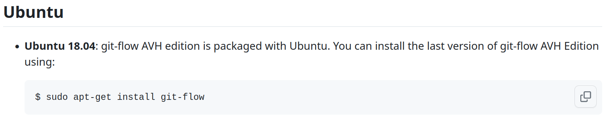
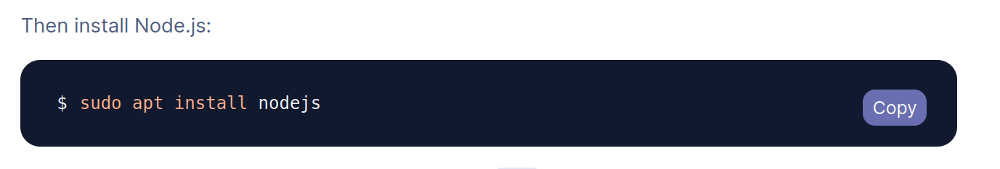
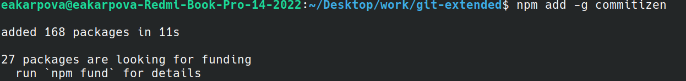
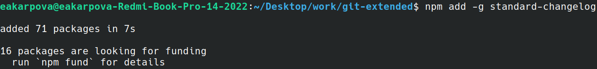
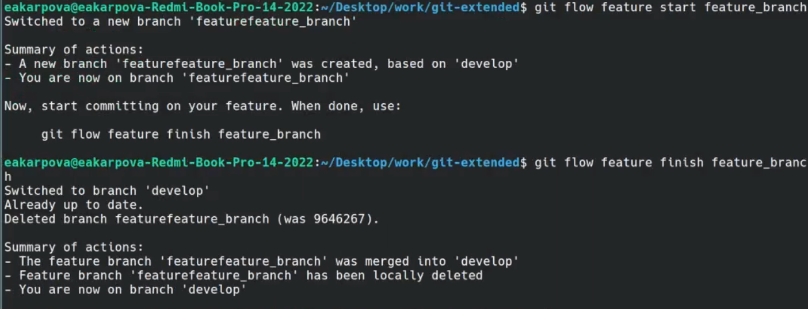
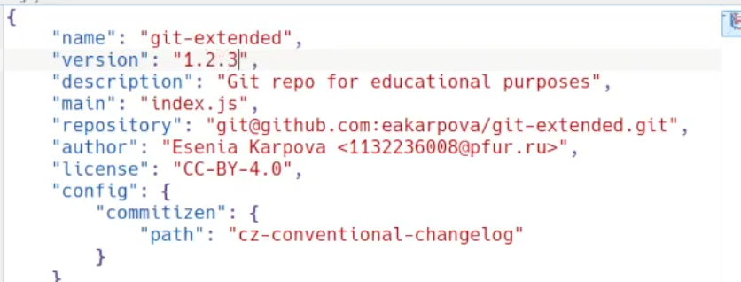
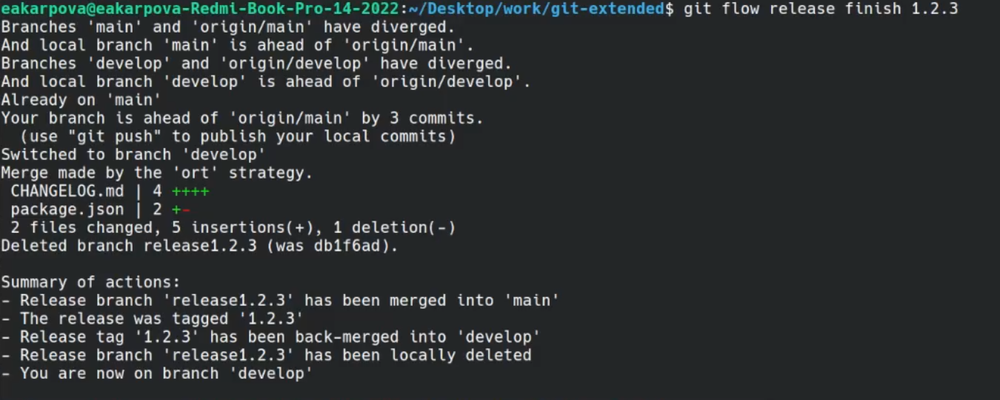

---
## Front matter
lang: ru-RU
title: Лабораторная работа № 4.
subtitle: Продвинутое использование git
author:
  - Карпова Е.А.
institute:
  - Российский университет дружбы народов, Москва, Россия
date: 23 февраля 2024

## i18n babel
babel-lang: russian
babel-otherlangs: english

## Formatting pdf
toc: false
toc-title: Содержание
slide_level: 2
aspectratio: 169
section-titles: true
theme: metropolis
header-includes:
 - \metroset{progressbar=frametitle,sectionpage=progressbar,numbering=fraction}
 - '\makeatletter'
 - '\beamer@ignorenonframefalse'
 - '\makeatother'
---

# Информация

## Докладчик

:::::::::::::: {.columns align=center}
::: {.column width="70%"}

  * Карпова Есения Алексеевна
  * Студентка НКАбд-02-23
  * ФФМиЕН
  * Российский университет дружбы народов
  * [1132236008@pfur.ru](mailto:1132236008@pfur.ru)
  * <https://github.com/eakarpova>

:::
::: {.column width="30%"}

:::
::::::::::::::

# Вводная часть

## Актуальность

- Каждому разработчику необходим навык правильной работы с репозиториями git

## Цели и задачи

- Цель: получение навыков правильной работы с репозиториями git

- Задачи:

1. Выполнить работу для тестового репозитория.
2. Преобразовать рабочий репозиторий в репозиторий с git-flow и conventional commits.

# Выполнение лабораторной работы

## Установка программного обеспечения

- Установка git-flow и Node.js

## Общепринятые коммиты

- Установка программ для форматирования коммитов и создания логов

## Работа с репозиториями git

- Создание ветки для новой функциональности

## Обновление версии в файле

- Создание релиза с версией 1.2.3 и обновление номера версии в файле package.json

## Залив релизной ветки

- Зальив релизной ветки в основную

# Результаты

## Результаты

- В ходе лабораторной работы я получила навык правильной работы с репозиториями git

