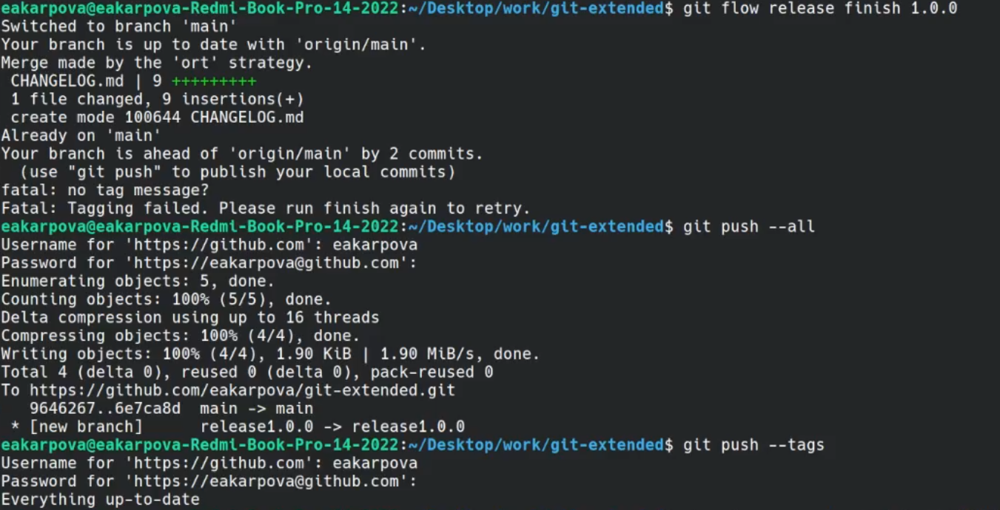
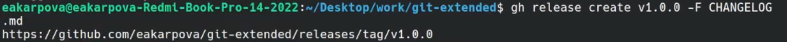
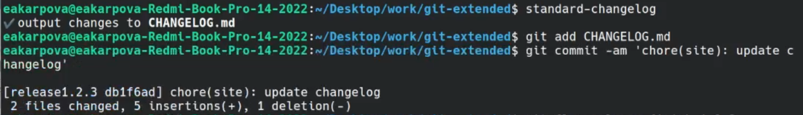

---
## Front matter
title: "Лабораторная работа №4"
subtitle: "Продвинутое использование git"
author: "Карпова Есения Алексеевна"

## Generic otions
lang: ru-RU
toc-title: "Содержание"

## Bibliography
bibliography: bib/cite.bib
csl: pandoc/csl/gost-r-7-0-5-2008-numeric.csl

## Pdf output format
toc: true # Table of contents
toc-depth: 2
lof: true # List of figures
lot: true # List of tables
fontsize: 12pt
linestretch: 1.5
papersize: a4
documentclass: scrreprt
## I18n polyglossia
polyglossia-lang:
  name: russian
  options:
	- spelling=modern
	- babelshorthands=true
polyglossia-otherlangs:
  name: english
## I18n babel
babel-lang: russian
babel-otherlangs: english
## Fonts
mainfont: PT Serif
romanfont: PT Serif
sansfont: PT Sans
monofont: PT Mono
mainfontoptions: Ligatures=TeX
romanfontoptions: Ligatures=TeX
sansfontoptions: Ligatures=TeX,Scale=MatchLowercase
monofontoptions: Scale=MatchLowercase,Scale=0.9
## Biblatex
biblatex: true
biblio-style: "gost-numeric"
biblatexoptions:
  - parentracker=true
  - backend=biber
  - hyperref=auto
  - language=auto
  - autolang=other*
  - citestyle=gost-numeric
## Pandoc-crossref LaTeX customization
figureTitle: "Рис."
tableTitle: "Таблица"
listingTitle: "Листинг"
lofTitle: "Список иллюстраций"
lotTitle: "Список таблиц"
lolTitle: "Листинги"
## Misc options
indent: true
header-includes:
  - \usepackage{indentfirst}
  - \usepackage{float} # keep figures where there are in the text
  - \floatplacement{figure}{H} # keep figures where there are in the text
---

# Цель работы

Получение навыков правильной работы с репозиториями git.

# Задание

1. Выполнить работу для тестового репозитория.
2. Преобразовать рабочий репозиторий в репозиторий с git-flow и conventional commits.

# Теоретическое введение

Рабочий процесс Gitflow:

Рабочий процесс Gitflow Workflow. Будем описывать его с использованием пакета git-flow.

Общая информация:

Gitflow Workflow опубликована и популяризована Винсентом Дриссеном.
Gitflow Workflow предполагает выстраивание строгой модели ветвления с учётом выпуска проекта.
Данная модель отлично подходит для организации рабочего процесса на основе релизов.
Работа по модели Gitflow включает создание отдельной ветки для исправлений ошибок в рабочей среде.
Последовательность действий при работе по модели Gitflow:
Из ветки master создаётся ветка develop.
Из ветки develop создаётся ветка release.
Из ветки develop создаются ветки feature.
Когда работа над веткой feature завершена, она сливается с веткой develop.
Когда работа над веткой релиза release завершена, она сливается в ветки develop и master.
Если в master обнаружена проблема, из master создаётся ветка hotfix.
Когда работа над веткой исправления hotfix завершена, она сливается в ветки develop и master.

# Выполнение лабораторной работы

1. Выполнение работы для тестового репозитория

Для начала нужно установить необходимое ПО,в моем случае для ubuntu. Ввожу нужную команду для устновки git-flow (рис. [-@fig:001]).

{#fig:001 width=100%}

Ввожу нужную команду для установки Node.js (рис. [-@fig:002]).

{#fig:002 width=100%}

Также мне понадобится curl для работы с данными сервера (рис. [-@fig:003]).

{#fig:003 width=100%}

Использую curl без аргументов для выполнения HTTP-запроса (рис. [-@fig:004]).

{#fig:004 width=100%}

Ввожу команду для перезагрузки (рис. [-@fig:005]).

{#fig:005 width=100%}

Для формотирования коммитов и скрипта git-cz использую приведенную ниже программу (рис. [-@fig:006]).

{#fig:006 width=100%}

Для создания логов использую приведенную ниже программу (рис. [-@fig:007]).

{#fig:007 width=100%}

Создаю репозиторий git-extended, делаю первый коммит и выкладываю на github(рис. [-@fig:008]).

{#fig:008 width=100%}

Для конфигурации общепринятых коммитов ввожу команду (рис. [-@fig:009]).

{#fig:009 width=100%}

Для того чтобы сконфигурировать формат коммитов добавим в исходный файл команду для формирования коммитов (рис. [-@fig:010]).

{#fig:010 width=100%} width=100%}

Добвыим новые файлы и выполним коммит, после чего отправим на github(рис. [-@fig:011]).

{#fig:011 width=100%}

Инициализируем git-flow (рис. [-@fig:012]).

{#fig:012 width=100%}

Проверим, что находимся на ветке develop (рис. [-@fig:013]).

{#fig:013 width=100%}

Загрузим весь репозиторий в хранилище и установим внешнюю ветку как вышестоящую, после чего создадим релиз с версией 1.0.0. (рис. [-@fig:014]).

{#fig:014 width=100%}

Создаем журнал изменений и добавляем его в индекс (рис. [-@fig:015]).

{#fig:015 width=100%}

Зальем релизную ветку в основную и отправим данные на github (рис. [-@fig:016]).

{#fig:016 width=100%}

Создадим релиз на github с помощью утилиты (рис. [-@fig:017]).

{#fig:017 width=100%}

2. Преобразовывание рабочего репозитория в репозиторий с git-flow и conventional commits.

Создадим ветку для новой функциональности (рис. [-@fig:018]).

{#fig:018 width=100%}

Создадим релиз с версией 1.2.3 и обновим номер версии в файле package.json (рис. [-@fig:019]).

{#fig:019 width=100%}

Создадим журнал изменений и добавим его в индекс (рис. [-@fig:020]).

{#fig:020 width=100%}

Зальем релизную ветку в основную (рис. [-@fig:021]).

{#fig:021 width=100%}

Отправим данные на github (рис. [-@fig:022]).

{#fig:022 width=100%}

(рис. [-@fig:022]).

# Выводы

Я получила навыки правильной работы с репозиториями git

