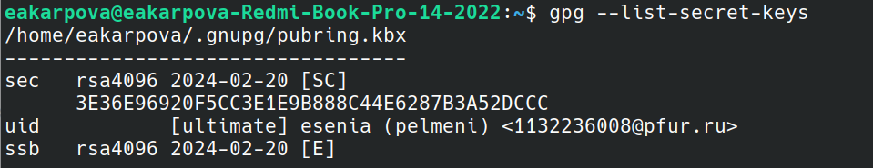
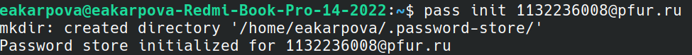
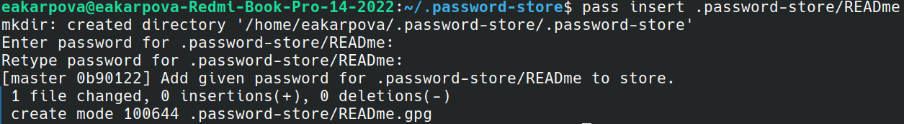
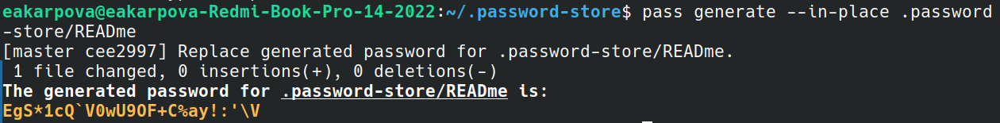
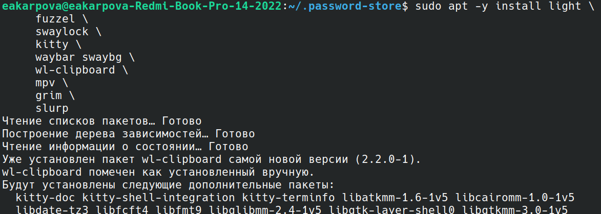
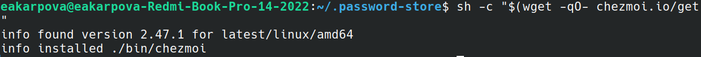
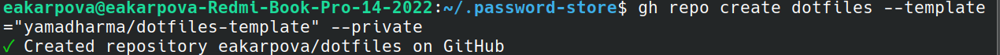
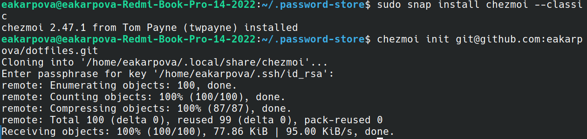
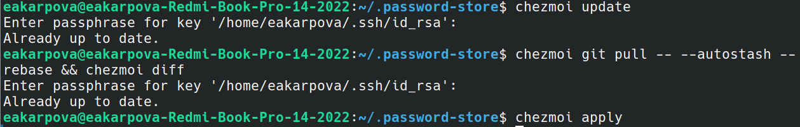
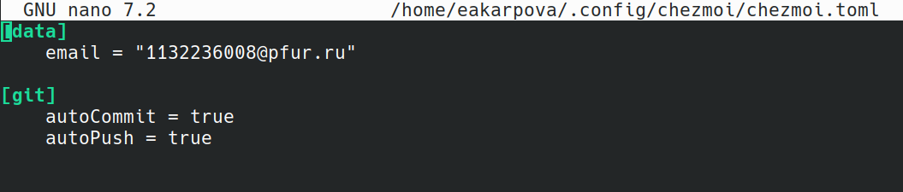

---
## Front matter
lang: ru-RU
title: Laboratory work No. 5
subtitle: Customizing the working environment
author:
  - Karpova E.A.
institute:
  - Peoples' Friendship University of Russia, Moscow, Russia
date: March 9, 2024

## i18n babel
babel-lang: russian
babel-otherlangs: english

## Formatting pdf
toc: false
toc-title: Contents
slide_level: 2
aspectratio: 169
section-titles: true
theme: metropolis
header-includes:
 - \metroset{progressbar=frametitle,sectionpage=progressbar,numbering=fraction}
 - '\makeatletter'
 - '\beamer@ignorenonframefalse'
 - '\makeatother'
---

# Information

## Speaker

  * Karpova Esenia Alexkseevna
  * Student NKAbd-02-23
  * Faculty of Physics and Mathematics
  * PFUR
  * [1132236008@pfur.ru](mailto:1132236008@pfur.ru)
  * <https://github.com/eakarpova>

# Introductory part

## Relevance

- Every programmer needs the skill to customize the working environment

## Aims and objectives

- Purpose of the work

Acquire the skill to customize the working environment

- Tasks

1. Install the pass password manager
2. Manage configuration files

# Execution of laboratory work

## Installing the password manager pass

- Configuring gpg keys - view keys

- Storage initialization

## Customizing the interface with the browser

- Adding a new password

- Replacing an existing password

## `html` format

- Installation of additional software

- Installing a binary that detects the processor architecture and operating system and downloads the required file

## Configuration file management

- Creating your own repository using template-based configuration file utilities

- Connecting a repository to your system: initializing chezmoi with dotfiles repository

## Code for `html` format

- I retrieve the latest changes from the repository and apply them first with a single command, then in stages

- Enable automatic commit and send of repository changes

# Results

In the course of the laboratory work I acquired the skill of customizing the working environment

