---
## Front matter
title: "Лабораторная работа №5"
subtitle: "Настройка рабочей среды"
author: "Карпова Есения Алексеевна"

## Generic otions
lang: ru-RU
toc-title: "Содержание"

## Bibliography
bibliography: bib/cite.bib
csl: pandoc/csl/gost-r-7-0-5-2008-numeric.csl

## Pdf output format
toc: true # Table of contents
toc-depth: 2
lof: true # List of figures
lot: true # List of tables
fontsize: 12pt
linestretch: 1.5
papersize: a4
documentclass: scrreprt
## I18n polyglossia
polyglossia-lang:
  name: russian
  options:
	- spelling=modern
	- babelshorthands=true
polyglossia-otherlangs:
  name: english
## I18n babel
babel-lang: russian
babel-otherlangs: english
## Fonts
mainfont: PT Serif
romanfont: PT Serif
sansfont: PT Sans
monofont: PT Mono
mainfontoptions: Ligatures=TeX
romanfontoptions: Ligatures=TeX
sansfontoptions: Ligatures=TeX,Scale=MatchLowercase
monofontoptions: Scale=MatchLowercase,Scale=0.9
## Biblatex
biblatex: true
biblio-style: "gost-numeric"
biblatexoptions:
  - parentracker=true
  - backend=biber
  - hyperref=auto
  - language=auto
  - autolang=other*
  - citestyle=gost-numeric
## Pandoc-crossref LaTeX customization
figureTitle: "Рис."
tableTitle: "Таблица"
listingTitle: "Листинг"
lofTitle: "Список иллюстраций"
lotTitle: "Список таблиц"
lolTitle: "Листинги"
## Misc options
indent: true
header-includes:
  - \usepackage{indentfirst}
  - \usepackage{float} # keep figures where there are in the text
  - \floatplacement{figure}{H} # keep figures where there are in the text
---

# Цель работы

Приобрести навык настройки рабочей среды

# Задание

1. Установить менеджер паролей pass
2. Управление файлами конфигурации

# Теоретическое введение

Менеджер паролей pass — программа, сделанная в рамках идеологии Unix.
Основные свойства:
    1. Данные хранятся в файловой системе в виде каталогов и файлов.
    2. Файлы шифруются с помощью GPG-ключа.

Структура базы паролей:
    Структура базы может быть произвольной, если Вы собираетесь использовать её напрямую, без промежуточного программного обеспечения. Тогда семантику структуры базы данных Вы держите в своей голове.
    Если же необходимо использовать дополнительное программное обеспечение, необходимо семантику заложить в структуру базы паролей.

Управление файлами конфигурации:
    Использование chezmoi для управления файлами конфигурации домашнего каталога пользователя.

Общая информация:
    Сайт: https://www.chezmoi.io/
    Репозиторий: https://github.com/twpayne/chezmoi

# Выполнение лабораторной работы

1. Установка менеджера паролей pass

Установка менеджера паролей pass (рис. [-@fig:001]).

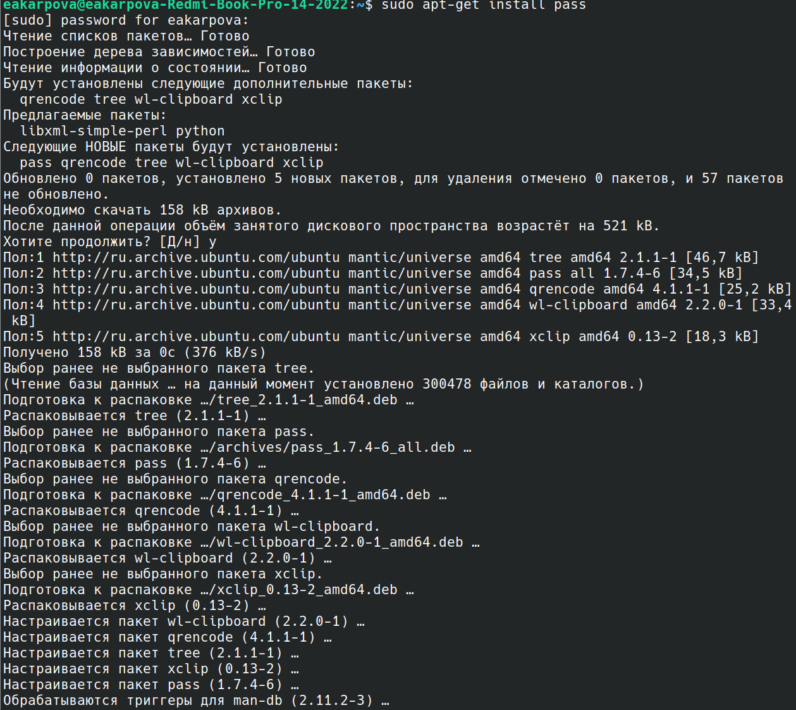{#fig:001 width=100%}

Настройка ключей gpg - просмотр ключей (рис. [-@fig:002]).

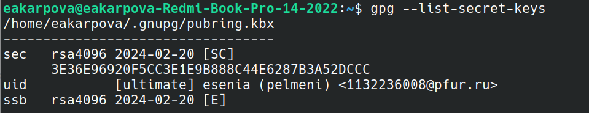{#fig:002 width=100%}

Инициализация хранилища (рис. [-@fig:003]).

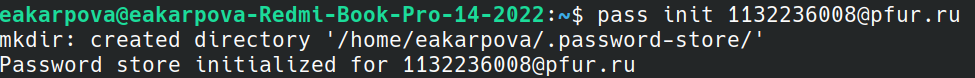{#fig:003 width=100%}

Синхронизация с git: создание структуры git (рис. [-@fig:004]).

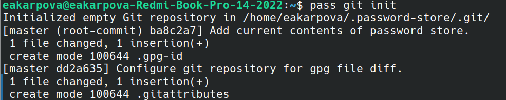{#fig:004 width=100%}

Задание адреса репозитория на хостинге (рис. [-@fig:005]).

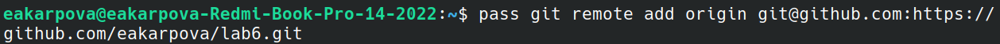{#fig:005 width=100%}

Выполнение синхронизации (рис. [-@fig:006]).

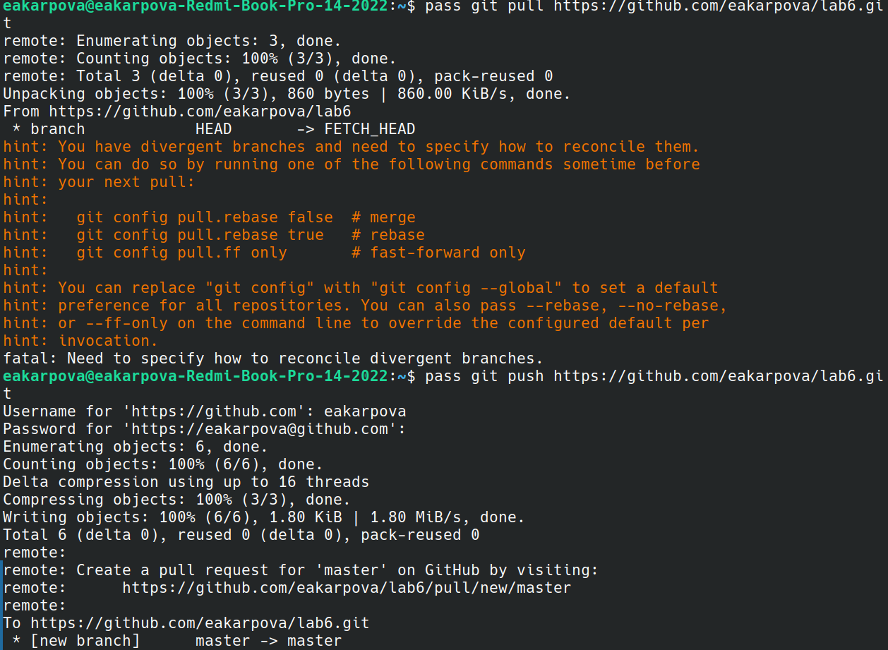{#fig:006 width=100%}

Выполнение прямых изменений с заполнением коммитов и отправкой данных вручную(рис. [-@fig:007]).

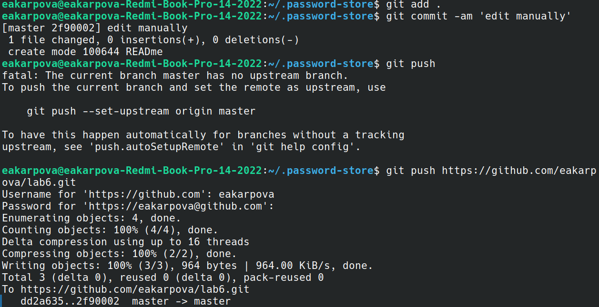{#fig:007 width=100%}

Проверка статуса синхронизации (рис. [-@fig:008]).

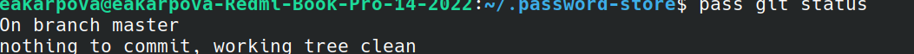{#fig:008 width=100%}

Настройка интерфейса с браузером (так как моя ОС - -Ubuntu, выполняю необходимые команды с помощью curl)(рис. [-@fig:009]).

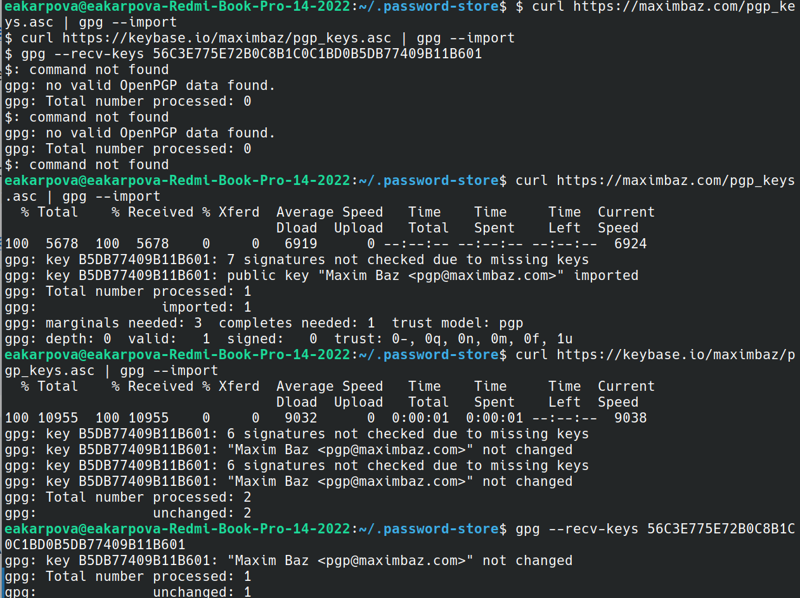{#fig:009 width=100%}

Добавление нового пароля (рис. [-@fig:010]).

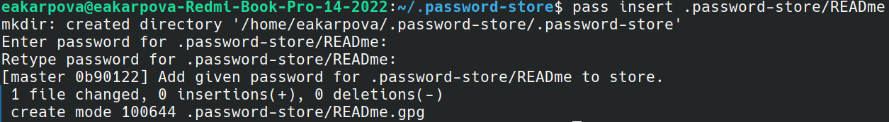{#fig:010 width=100%}

Замена существующего пароля (рис. [-@fig:011]).

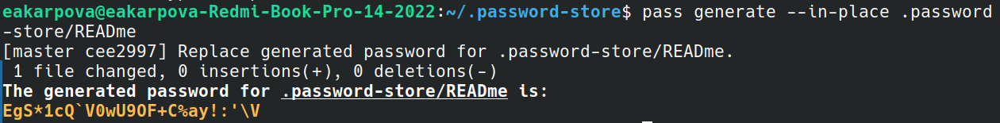{#fig:011 width=100%}

2. Управление файлами конфигурации

Установка дополнительного программного обеспечения (рис. [-@fig:012]).

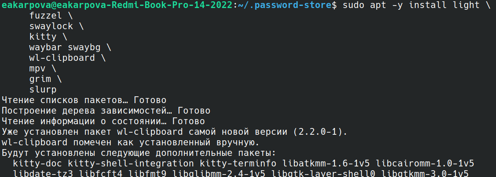{#fig:012 width=100%}

Установка бинарного файла, который определяет архитектуру процессора и операционную систему и скачивает необходимый файл (рис. [-@fig:013]).

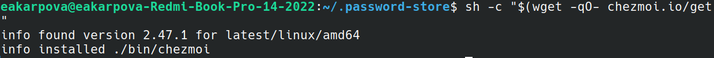{#fig:013 width=100%}

Создание собственного репозитория с помощью утилит для конфигурационных файлов на основе шаблона (рис. [-@fig:014]).

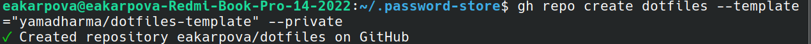{#fig:014 width=100%}

Подключение репозитория к своей системе: инициализация chezmoi с репозиторием dotfiles (рис. [-@fig:015]).

{#fig:015 width=100%}

Проверяю изменения, внесенные с помощью  chezmoi diff, после чего инициализирую  chezmoi на второй машине с репозиторием. Проверив изменения запускаю команду chezmoi apply -v (рис. [-@fig:016]).

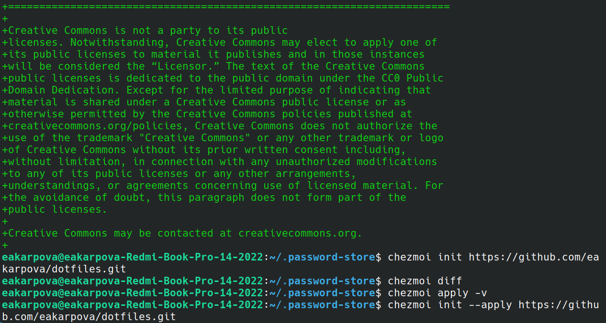{#fig:016 width=100%}

Извлекаю последние изменения из репозитория и применяю их сначала одной командой, затем поэтапно (рис. [-@fig:017]).

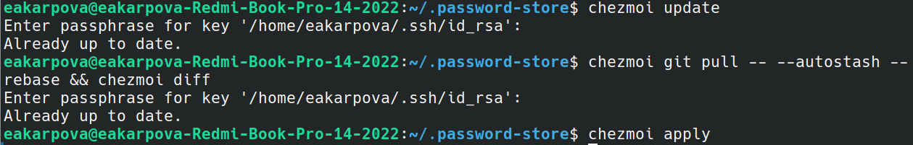{#fig:017 width=100%}

Включение функции автоматического фиксирования и отправления изменений репозитория (рис. [-@fig:018]).

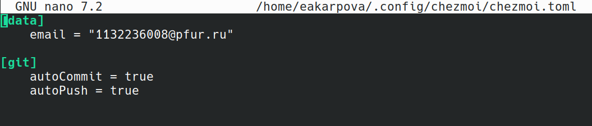{#fig:018 width=100%}

# Выводы

В ходе лабораторной работы я приобрела навык настройки рабочей среды

# Список литературы{.unnumbered}

::: {#refs}
:::
