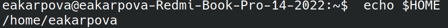
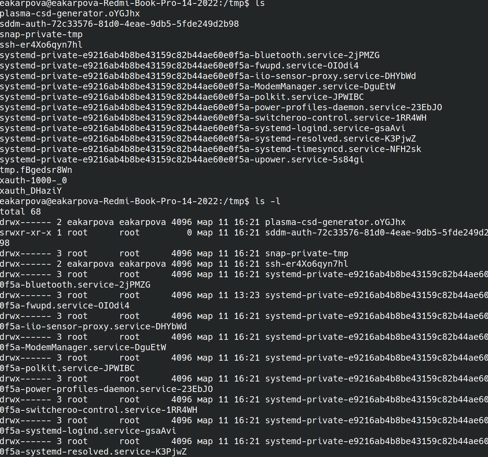
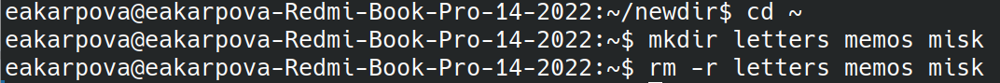
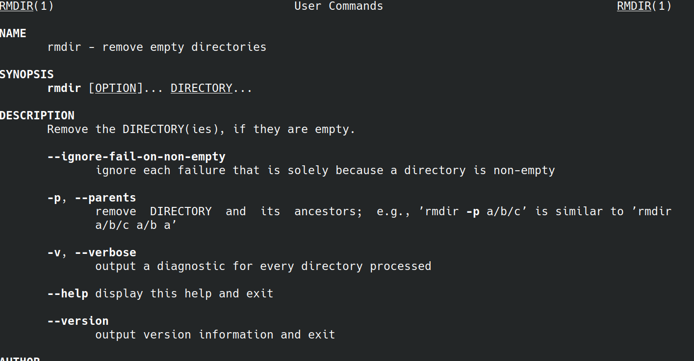
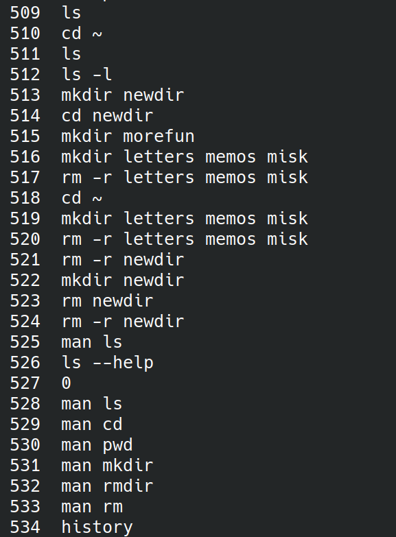

---
## Front matter
lang: ru-RU
title: Laboratory work No. 5
subtitle: Customizing the working environment
author:
  - Karpova E.A.
institute:
  - Peoples' Friendship University of Russia, Moscow, Russia
date: March 9, 2024

## i18n babel
babel-lang: russian
babel-otherlangs: english

## Formatting pdf
toc: false
toc-title: Contents
slide_level: 2
aspectratio: 169
section-titles: true
theme: metropolis
header-includes:
 - \metroset{progressbar=frametitle,sectionpage=progressbar,numbering=fraction}
 - '\makeatletter'
 - '\beamer@ignorenonframefalse'
 - '\makeatother'
---

# Information

## Speaker

:::::::::::::: {.columns align=center}
::: {.column width="70%"}

  * Karpova Esenia Alexkseevna
  * student NKAbd-02-23
  * faculty of physicks and mathematics
  * PFUR
  * [1132236008@pfur.ru](mailto:1132236008@pfur.ru)
  * <https://github.com/eakarpova>

:::
::: {.column width="30%"}

:::
::::::::::::::

## Introduction

## Relevance

- Every programmer needs the skill of using Unix system at the command line level to work faster and more efficiently.

## Purpose of the work

To acquire practical skills of interacting with the system via the command line

# Tasks

1. determine the full name of the home directory
2. Using cd and ls
3. Using man
4. Using history

## Doing lab work

## Determine the full name of the home directory

## Using cd and ls

## Using cd and ls

## Creating and deleting directories

## Man command

## The history command

## The history command

## Results

During the laboratory work I acquired practical skills of interacting with the system via the command line
