---
## Front matter
title: Лаборторная работа №6
subtitle: Основы интерфейса взаимодействия пользователя с системой Unix на уровне командной строки
author: Карпова Есения Алексеевна

## Generic otions
lang: ru-RU
toc-title: "Содержание"

## Bibliography
bibliography: bib/cite.bib
csl: pandoc/csl/gost-r-7-0-5-2008-numeric.csl

## Pdf output format
toc: true # Table of contents
toc-depth: 2
lof: true # List of figures
lot: true # List of tables
fontsize: 12pt
linestretch: 1.5
papersize: a4
documentclass: scrreprt
## I18n polyglossia
polyglossia-lang:
  name: russian
  options:
	- spelling=modern
	- babelshorthands=true
polyglossia-otherlangs:
  name: english
## I18n babel
babel-lang: russian
babel-otherlangs: english
## Fonts
mainfont: PT Serif
romanfont: PT Serif
sansfont: PT Sans
monofont: PT Mono
mainfontoptions: Ligatures=TeX
romanfontoptions: Ligatures=TeX
sansfontoptions: Ligatures=TeX,Scale=MatchLowercase
monofontoptions: Scale=MatchLowercase,Scale=0.9
## Biblatex
biblatex: true
biblio-style: "gost-numeric"
biblatexoptions:
  - parentracker=true
  - backend=biber
  - hyperref=auto
  - language=auto
  - autolang=other*
  - citestyle=gost-numeric
## Pandoc-crossref LaTeX customization
figureTitle: "Рис."
tableTitle: "Таблица"
listingTitle: "Листинг"
lofTitle: "Список иллюстраций"
lotTitle: "Список таблиц"
lolTitle: "Листинги"
## Misc options
indent: true
header-includes:
  - \usepackage{indentfirst}
  - \usepackage{float} # keep figures where there are in the text
  - \floatplacement{figure}{H} # keep figures where there are in the text
---

# Цель работы

Приобретение практических навыков взаимодействия с системой посредством командной строки

# Задание

1. Определение полного имени домашнего каталога
2. Применение cd  и ls
3. Применение man
4. Применение history

# Теоретическое введение

## Формат команды

Командой в операционной системе называется записанный по
специальным правилам текст (возможно с аргументами), представляющий собой ука-
зание на выполнение какой-либо функций (или действий) в операционной системе.
Обычно первым словом идёт имя команды, остальной текст — аргументы или опции,
конкретизирующие действие.
** Общий формат команд можно представить следующим образом:
<имя_команды><разделитель><аргументы> **

## Основные команды

1. Команда man. Команда man используется для просмотра (оперативная помощь) в диа-
логовом режиме руководства (manual) по основным командам операционной системы
типа Linux

2. Команда cd. Команда cd используется для перемещения по файловой системе операционной системы типа Linux

3. Команда pwd. Для определения абсолютного пути к текущему каталогу используется команда pwd (print working directory)

4. Команда ls. Команда ls используется для просмотра содержимого каталога

5. Команда mkdir. Команда mkdir используется для создания каталогов

6. Команда rm. Команда rm используется для удаления файлов и/или каталогов

7. Команда history. Для вывода на экран списка ранее выполненных команд исполь-
зуется команда history.

# Выполнение лабораторной работы

1. Определение полного имени домашнего каталога

С помощью команды echo определяю полное имя домашнего каталога

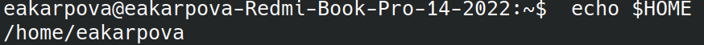

2. Применение cd и ls

С помощью команды cd перехожу в каталог tmp

Вывожу содержимое каталога tmp с помощью команды ls и получаю перечисление каталогов, хранящихся в этой директории. После этого использую команду ls -l и получаю перечисление каталогов с дополнительной информацией (владелец, дата редактирования, размер)

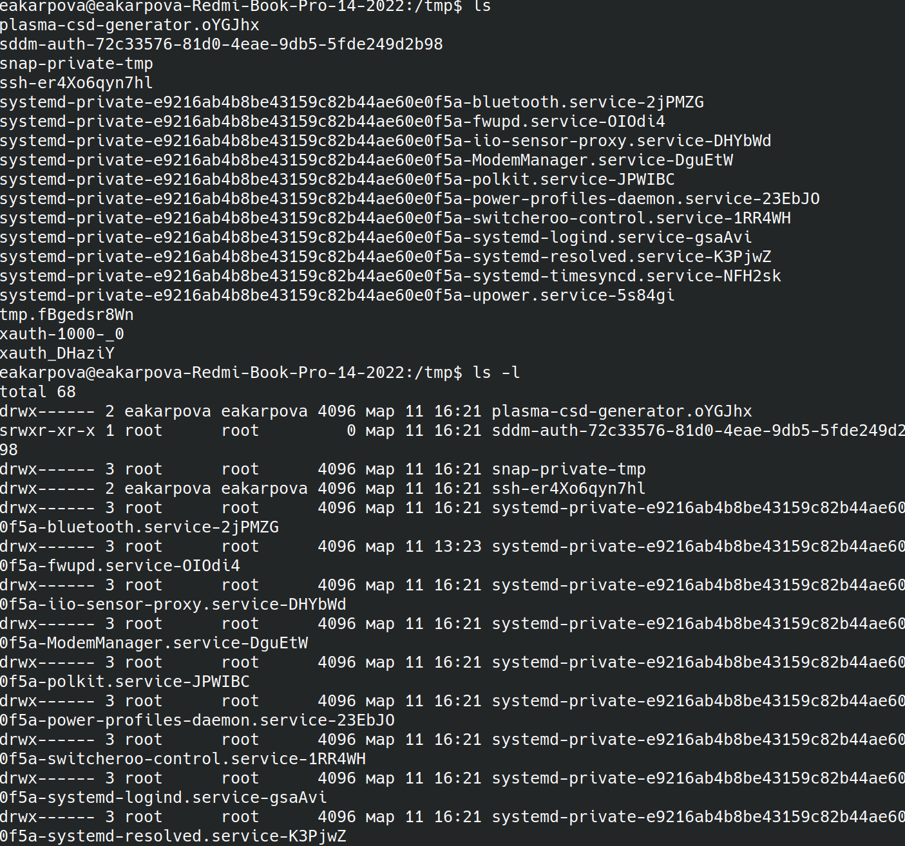

Определяю с помощью команды ls есть ли в каталоге /var/spool подкаталог cron. Он там есть.

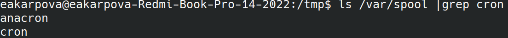

Перехожу в домашний каталог и с помощью команды ls -l вывожу на экран его содержимое. Опция -l- позволяет определить, кто является владльецем файлов и подкаталогов (это я)

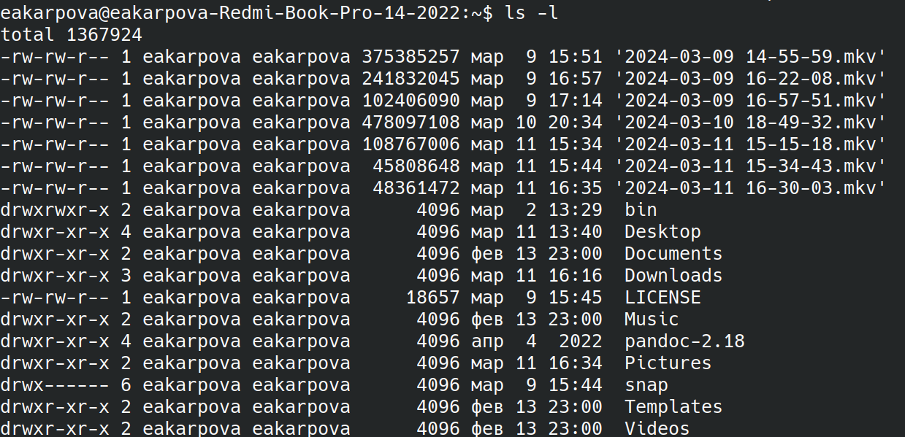

Создаю новый каталог с именем newdir с помощью команды mkdir. Перехожу в него и создаю в нем подкаталог morefun

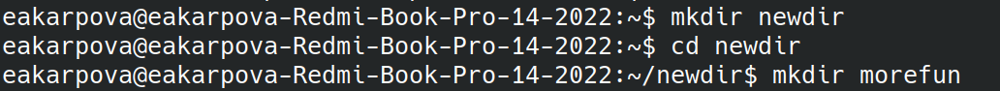

Перехожу в домашний каталог и с помощью команды mkdir в одну строку создаю три новых каталога letters, memos и misk. Затем с помощью команды rm -r удаляю их одной командой.

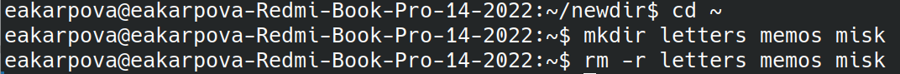

Пробую удалить ранее созданный каталог mkdir с помощью rm, но у меня не получается, так как newdir - директория, а не файл

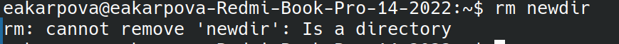

Удаляю директории newdir/morefun с помощью  rm -r. Директория удалилась, так как была использована опция -r

3. Применение man

С помощью команды man вывожу информацию о команде ls и ее опциях. Нахожу нужную опцию, которую используют для того, чтобы отсортировать по времени последнего изменения выводимый список содержимого каталога с развёрнутым описанием файлов: --time

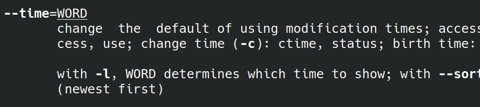

С помощью команды man вывожу информацию о команде ls и ее опциях. Нахожу нужную опцию, которую используют для того, чтобы просматривать содержимое не только указанного каталога, но и подкаталогов, входящих в него: -R, --recursive

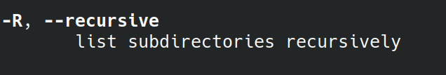

Использую команду man для просмотра описания команды cd, но в мануале нет никакой информации. Из теории знаю, что cd используется для перемещения по файловой системе операционной системы типа Linux, поэтому перехожу к следующей команде

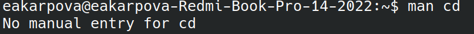

Ищу информацию о pwd с помощью команды man. Узнаю, что эта команда нужна для определения абсолютного пути к текущему каталогу (print working directory). У этой команды следующие опции:
1.  -L, --logical
Брать директорию из переменной окружения, даже если она содержит символические ссылки
2. -P
Отбрасывать все символические ссылки
3. --help
Отобразить справку по утилите
4. --version
Отобразить версию утилиты

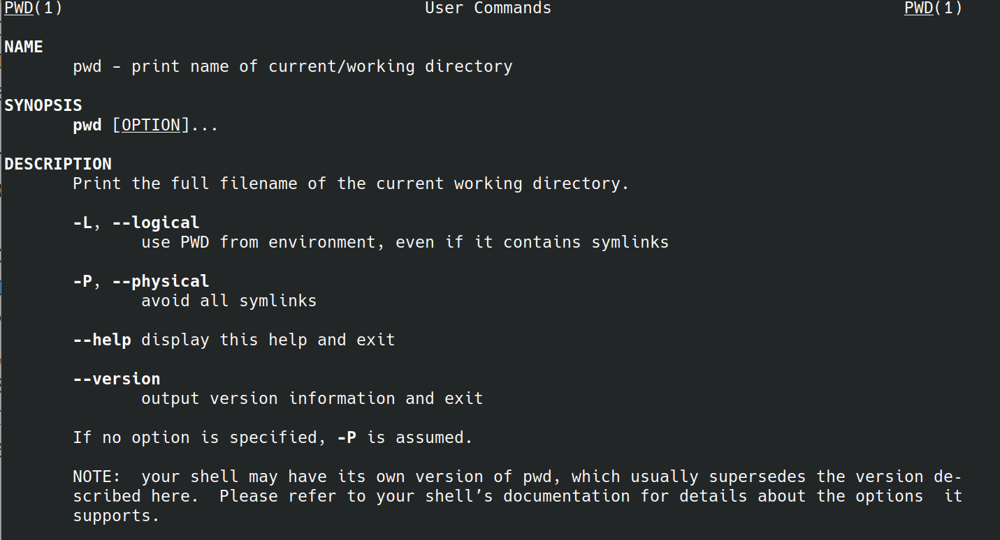

С помощью man узнаю, что mkdir - используется для создания каталогов. У этой команды следующие опции:
1. -v или --verbose
Выводить сообщение о каждой создаваемой директории.
2. -Z
Установить контекст SELinux для создаваемой директории по умолчанию.
3.  --context[=CTX]
Установить контекст SELinux для создаваемой директории в значение CTX
4. --help
Показать справку по команде mkdir
5. --version
Показать версию утилиты mkdir

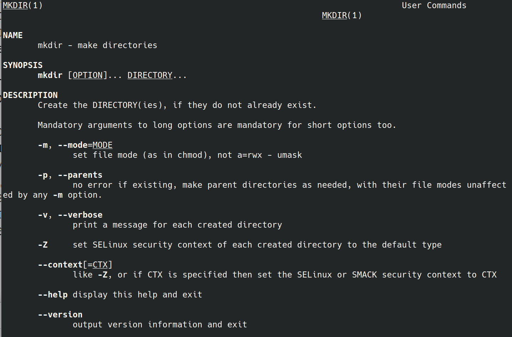

Из мануала узнаю, что rmdir используется для удаления пустых директорий. Также в нем указаны следующие опции:
1. --ignore-fail-on-non-empty
Игнорировать каждую ошибку, возникающую исключительно потому, что каталог непустой
2. -p, --parents
Удалить директорию и ее родительские директории; например, «rmdir -p a/b/c» аналогичен «rmdir a/b/c a/b a»
3. -v, --verbose
Выводить диагностику для каждого обработанного каталога
4. --help
Отобразить справку и выйти
5. --version
Вывести информацию о версии и выйти

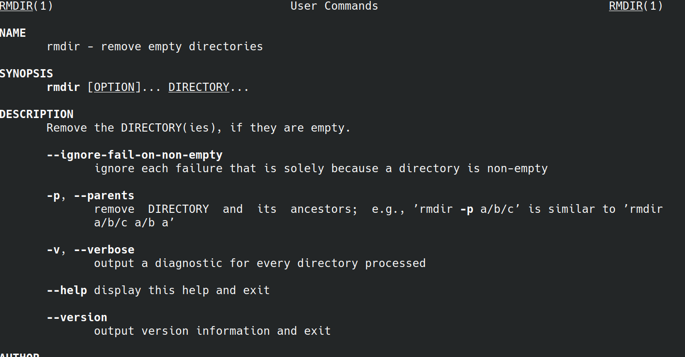

С помощью команды man узнаю, что rmd используется для удаления файлов и директорий. Также в нем указаны следующие опции:
1. -f или --force
Игнорировать несуществующие файлы и аргументы. Никогда не выдавать запросы на подтверждение удаления.
2. -i
Выводить запрос на подтверждение удаления каждого файла.
3. -I
Выдать один запрос на подтверждение удаления всех файлов, если удаляется больше трех файлов или используется рекурсивное удаление.
4. --interactive
Вместо КОГДА можно использовать:
    never — никогда не выдавать запросы на подтверждение удаления.
    once — выводить запрос один раз (аналог опции -I).
    always — выводить запрос всегда (аналог опции -i).
Если значение КОГДА не задано, то используется always
5. --one-file-system
Во время рекурсивного удаления пропускать директории, которые находятся на других файловых системах.
6. --no-preserve-root
Если в качестве директории для удаления задан корневой раздел /, то считать, что это обычная директория и начать выполнять удаление.
7. --preserve-root
Если в качестве директории для удаления задан корневой раздел /, то запретить выполнять команду rm над корневым разделом. Данное поведение используется по умолчанию.
8. -r или -R или --recursive
Удаление директорий и их содержимого. Рекурсивное удаление.
9. т-d или --dir
Удалять пустые директории.
10. -v или --verbose
Выводить информацию об удаляемых файлах.

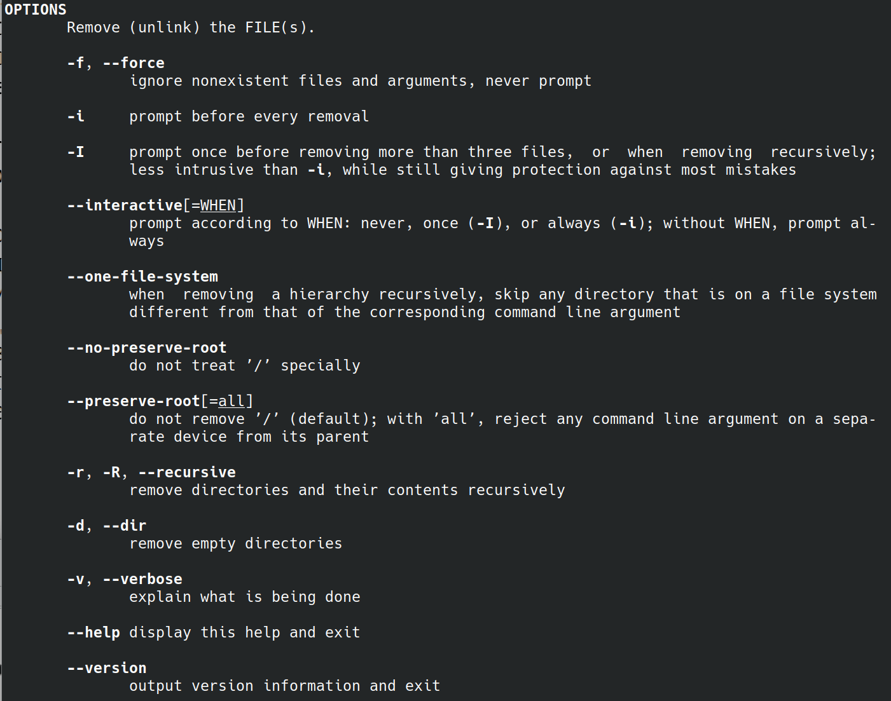

4. Применение history

С помощью команды history вывожу все использованные мною команды

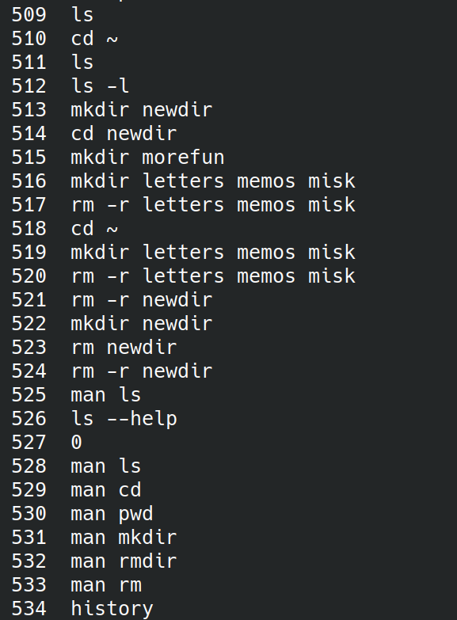

Используя конструкцию
!<номер_команды>:s/<что_меняем>/<на_что_меняем>
модифицирую команду - заменяю каталог tmp на Desktop

# Выводы

В ходе лабораторной работы я приобретела практические навыки взаимодействия с системой посредством командной строки
