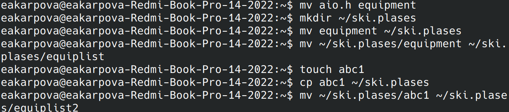
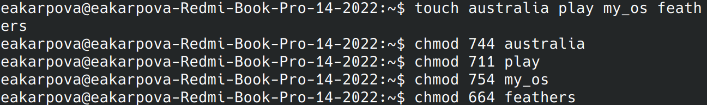
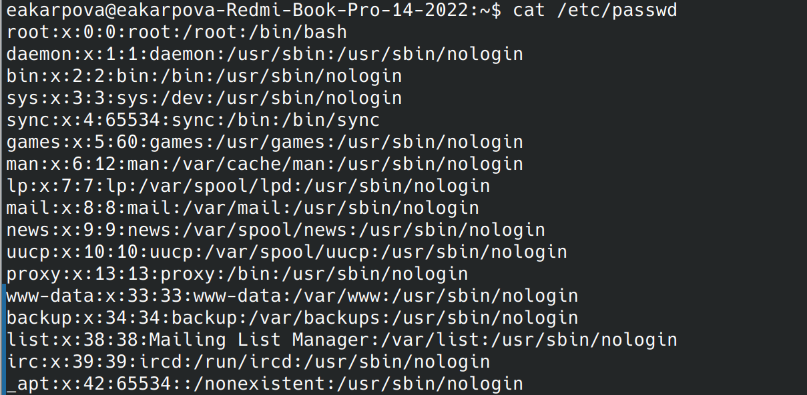
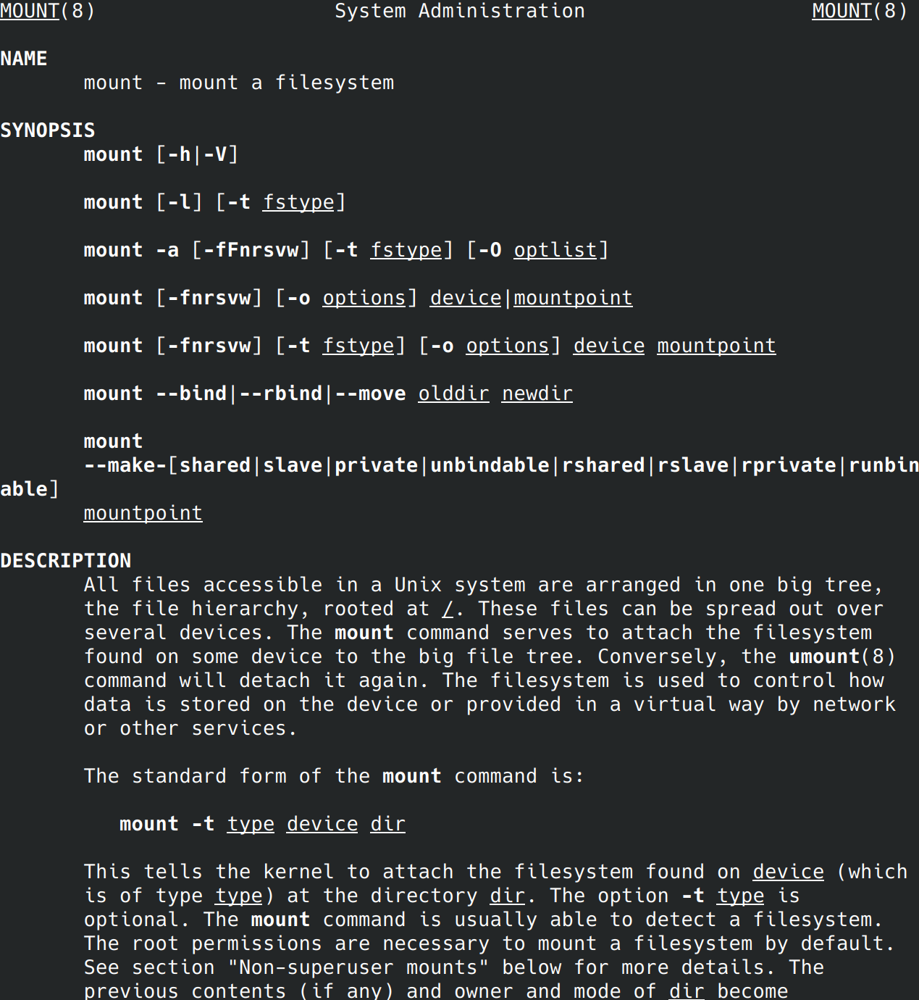
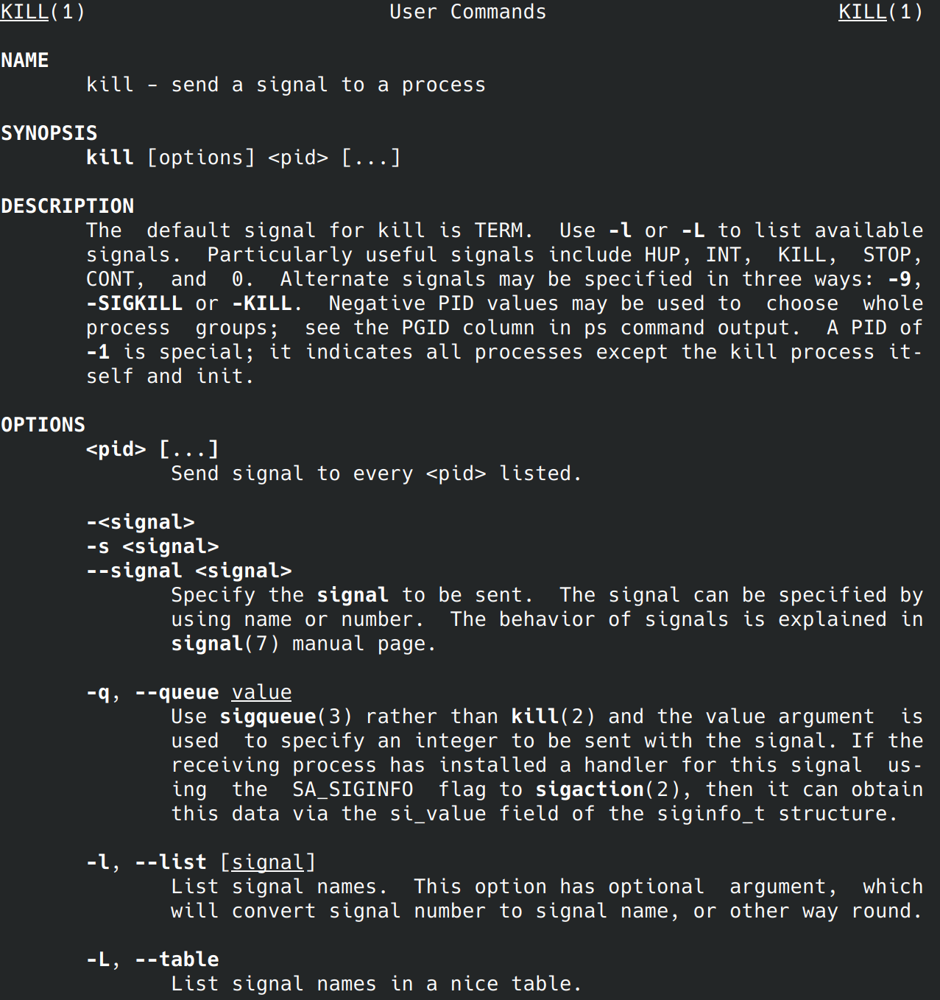

---
## Front matter
lang: ru-RU
title: Laboratory work No. 7
subtitle: Analyzing the Linux file system. Commands for working with files and directories
author:
  - Karpova E.A.
institute:
  - Peoples' Friendship University of Russia, Moscow, Russia
date: March 9, 2024

## i18n babel
babel-lang: russian
babel-otherlangs: english

## Formatting pdf
toc: false
toc-title: Contents
slide_level: 2
aspectratio: 169
section-titles: true
theme: metropolis
header-includes:
 - \metroset{progressbar=frametitle,sectionpage=progressbar,numbering=fraction}
 - '\makeatletter'
 - '\beamer@ignorenonframefalse'
 - '\makeatother'
---

# Information

## Speaker

  * Karpova Esenia Alexkseevna
  * student NKAbd-02-23
  * faculty of physicks and mathematics
  * PFUR
  * [1132236008@pfur.ru](mailto:1132236008@pfur.ru)
  * <https://github.com/eakarpova>

# Introductory part

## Aims

- Familiarize yourself with the Linux file system, its structure, names and contents of
directories.
- Acquisition of practical skills to use commands for working with files and directories, to manage processes (and jobs), to check disk usage and to maintain the file system.

# Tasks

1. Moving and renaming files and directories
2. changing access rights
3. Copying files and directories
4. Description of commands using the manual

# Performing laboratory work

## Moving and renaming files and directories

## Changing access rights

## Copying files and directories

## Description of commands using the manual

## Description of commands using the manual

# Results

- I familiarized myself with the Linux file system, its structure, names and content of
directories
- I acquired practical skills in using commands for working with files and directories, managing processes (and jobs), checking disk usage and maintaining the file system.

