---
## Front matter
title: "Лабораторная работа №5"
subtitle: "Анализ файловой системы Linux. Команды для работы с файлами и каталогами."
author: "Карпова Есения Алексеевна"

## Generic otions
lang: ru-RU
toc-title: "Содержание"

## Bibliography
bibliography: bib/cite.bib
csl: pandoc/csl/gost-r-7-0-5-2008-numeric.csl

## Pdf output format
toc: true # Table of contents
toc-depth: 2
lof: true # List of figures
lot: true # List of tables
fontsize: 12pt
linestretch: 1.5
papersize: a4
documentclass: scrreprt
## I18n polyglossia
polyglossia-lang:
  name: russian
  options:
	- spelling=modern
	- babelshorthands=true
polyglossia-otherlangs:
  name: english
## I18n babel
babel-lang: russian
babel-otherlangs: english
## Fonts
mainfont: PT Serif
romanfont: PT Serif
sansfont: PT Sans
monofont: PT Mono
mainfontoptions: Ligatures=TeX
romanfontoptions: Ligatures=TeX
sansfontoptions: Ligatures=TeX,Scale=MatchLowercase
monofontoptions: Scale=MatchLowercase,Scale=0.9
## Biblatex
biblatex: true
biblio-style: "gost-numeric"
biblatexoptions:
  - parentracker=true
  - backend=biber
  - hyperref=auto
  - language=auto
  - autolang=other*
  - citestyle=gost-numeric
## Pandoc-crossref LaTeX customization
figureTitle: "Рис."
tableTitle: "Таблица"
listingTitle: "Листинг"
lofTitle: "Список иллюстраций"
lotTitle: "Список таблиц"
lolTitle: "Листинги"
## Misc options
indent: true
header-includes:
  - \usepackage{indentfirst}
  - \usepackage{float} # keep figures where there are in the text
  - \floatplacement{figure}{H} # keep figures where there are in the text
---

# Цель работы

Ознакомление с файловой системой Linux, её структурой, именами и содержанием
каталогов. Приобретение практических навыков по применению команд для работы
с файлами и каталогами, по управлению процессами (и работами), по проверке исполь-
зования диска и обслуживанию файловой системы.

# Задание

1. Выполнение примеров
2. Перемещение и переименования файлов и каталогов
3. Изменение прав доступа
4. Копирование файлов и каталогов
5. Описание команд с помощью мануала

# Теоретическое введение

## Основные команды:

- Для создания текстового файла можно использовать команду touch.
Формат команды:
touch имя-файла
- Для просмотра файлов небольшого размера можно использовать команду cat.
Формат команды:
cat имя-файла
- Для просмотра файлов постранично удобнее использовать команду less.
Формат команды:
less имя-файла
- Команда cp используется для копирования файлов и каталогов.
Формат команды:
cp [-опции] исходный_файл целевой_файл
- Команды mv и mvdir предназначены для перемещения и переименования файлов
и каталогов.
Формат команды mv:
mv [-опции] старый_файл новый_файл

## Права доступа

Каждый файл или каталог имеет права доступа (табл. 5.1).
В сведениях о файле или каталоге указываются:
– тип файла (символ (-) обозначает файл, а символ (d) — каталог);
– права для владельца файла (r — разрешено чтение, w — разрешена запись, x — разре-
шено выполнение, - — право доступа отсутствует);
– права для членов группы (r — разрешено чтение, w — разрешена запись, x — разрешено
выполнение, - — право доступа отсутствует);
– права для всех остальных (r — разрешено чтение, w — разрешена запись, x — разрешено
выполнение, - — право доступа отсутствует).

## Изменение прав доступа

Права доступа к файлу или каталогу можно изменить, воспользовавшись командой
chmod. Сделать это может владелец файла (или каталога) или пользователь с правами
администратора.
Формат команды:
chmod режим имя_файла

## Анализ файловой системы

С помощью команды fsck можно проверить (а в ряде случаев восстановить) целост-
ность файловой системы:
Формат команды:
fsck имя_устройства

# Выполнение лабораторной работы

1. Выполнение примеров

Проверим работу примеров команд из первой части лабороторной работы. Пример копирования файлов и каталогов(рис. [-@fig:001]).

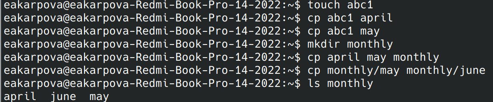{#fig:001 width=100%}

Пример копирования фалов с утилитой -r
(рис. [-@fig:002]).

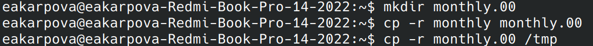{#fig:002 width=100%}

Пример перемещения и переименовани файлов и каталогов
(рис. [-@fig:003]).

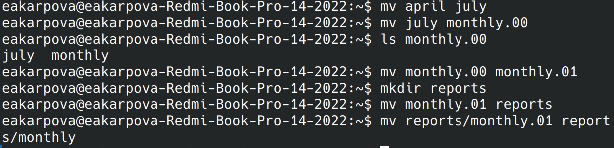{#fig:003 width=100%}

Пример изменения прав доступа (рис. [-@fig:004]).

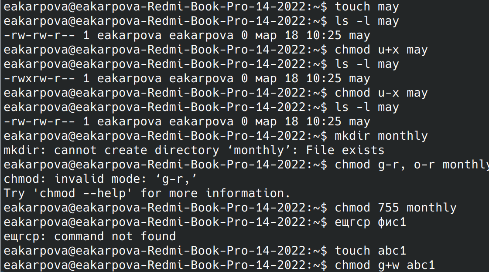{#fig:004 width=100%}

2. Перемещение и переименования файлов и каталогов

Копирую файл ~/usr/include/aio.h в домашний каталог и переименовываю его в equipment. Затем в домашнем каталоге создаю директорию ~/ski.plases и перемещаю в нее этот файл. Переименовываю equipment в equiplist. Создаю в домашнем каталоге файл abc1 и копирую его в ~/ski.plases с новым названием equiplist2 (рис. [-@fig:005]).

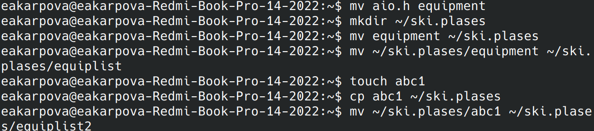{#fig:005 width=100%}

Создаю каталог equipmnet в ~/ski.plases и перемещаю в него файлы equiplist и equiplist2, после чего создаю директорию newdir и перемещаю его в ~/ski.plases с новым названием plans(рис. [-@fig:006]).

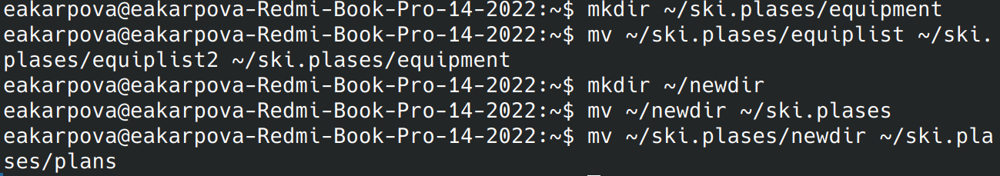{#fig:006 width=100%}

3. Изменение прав доступа

Создаю необходимые файлы с помощью команды touch. С помощью команды chmod и цифровой записи формы доступа присваиваю им выделенные права доступа (рис. [-@fig:007]).

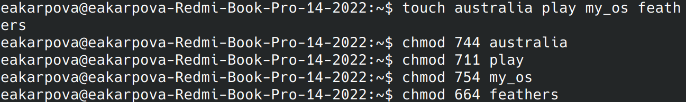{#fig:007 width=100%}

4. Копирование файлов и каталогов

С помощью команды cat просматриваю содержимое файла /etc/passwd (рис. [-@fig:008]).

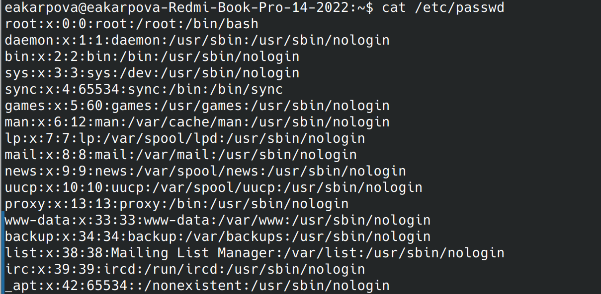{#fig:008 width=100%}

Копирую файл ~/feathers в файл ~/file.old, после чего перемещаю его в каталог ~/play и копирую ~/play в директорию ~/fun (рис. [-@fig:009]).

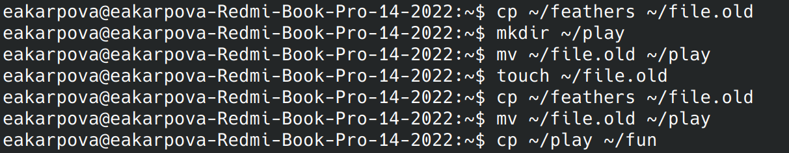{#fig:009 width=100%}

Перемещаю каталог ~/fun в ~/play и переименовываю его в games. С помощью команды chmod лишаю владельца файла права на чтение с помощью утилиты -r. Проверяю это командой cat - все сработало, так как мне отказано в доступе. Также я не могу скопировать этот файл. Возвращаю владельцу файла право на чтение с помощью команды chmod и утилиты +r. Затем лишаю владельца каталога ~/play права на выполнение. После чего пытаюсь перейти в эту директорию и получаю ошибку - отказано в доступе, значит команда сработала верно. Возвращаю владельцу право на выполнение.(рис. [-@fig:010]).

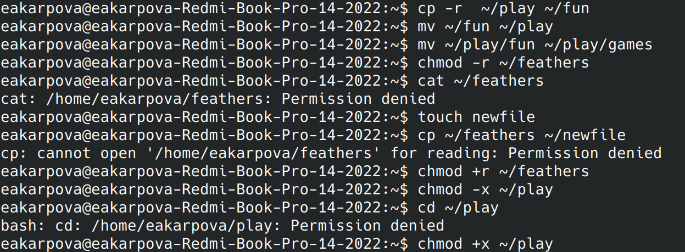{#fig:010 width=100%}

5. Описание команд с помощью мануала

С помощью команды man узнаю характеристики команды mount:
Команда mount в операционной системе Linux используется для подключения файловых систем к директориям в иерархии файловой системы. Это позволяет доступ к содержимому файловой системы. Пример использования: mount /dev/sdb1 /mnt
Эта команда подключает устройство /dev/sdb1 к директории /mnt. (рис. [-@fig:011]).

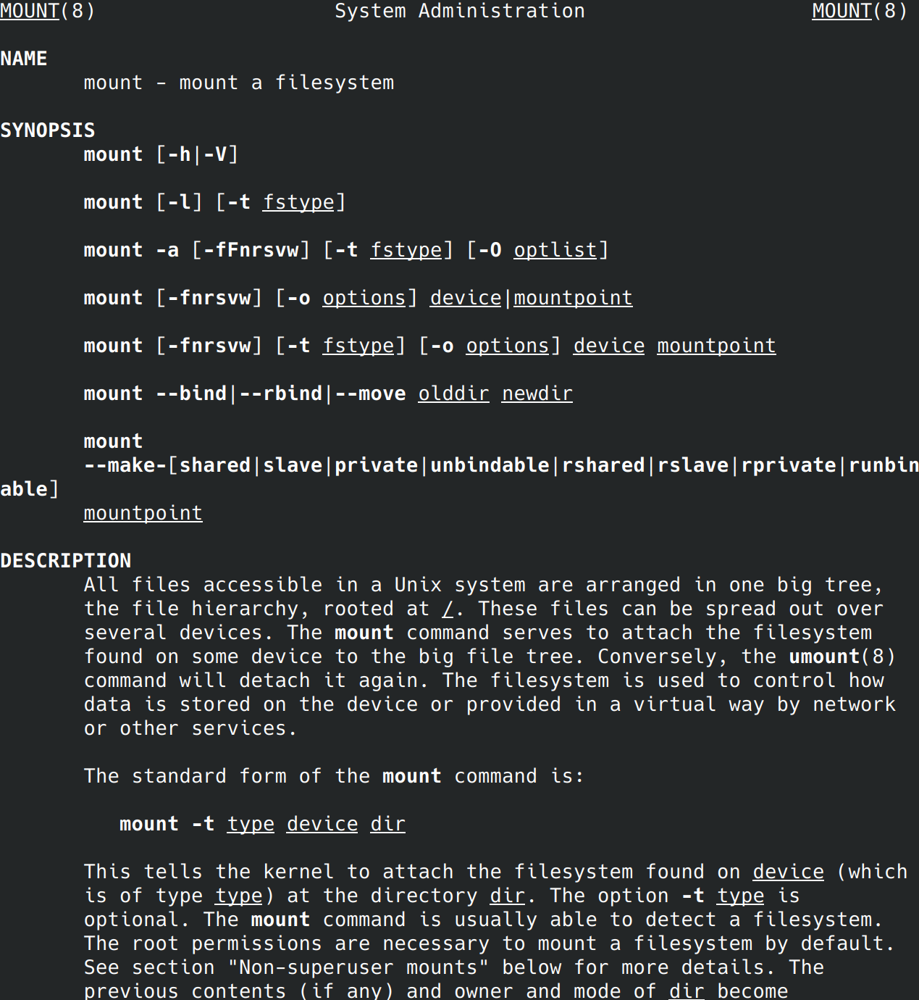{#fig:011 width=100%}

С помощью команды man узнаю характеристики команды fsck:
Команда fsck (File System Consistency Check) используется для проверки и исправления целостности файловой системы. Она помогает обнаружить и исправить ошибки на диске.
Пример использования:fsck /dev/sda1
Эта команда проверяет файловую систему на устройстве /dev/sda1. (рис. [-@fig:012]).

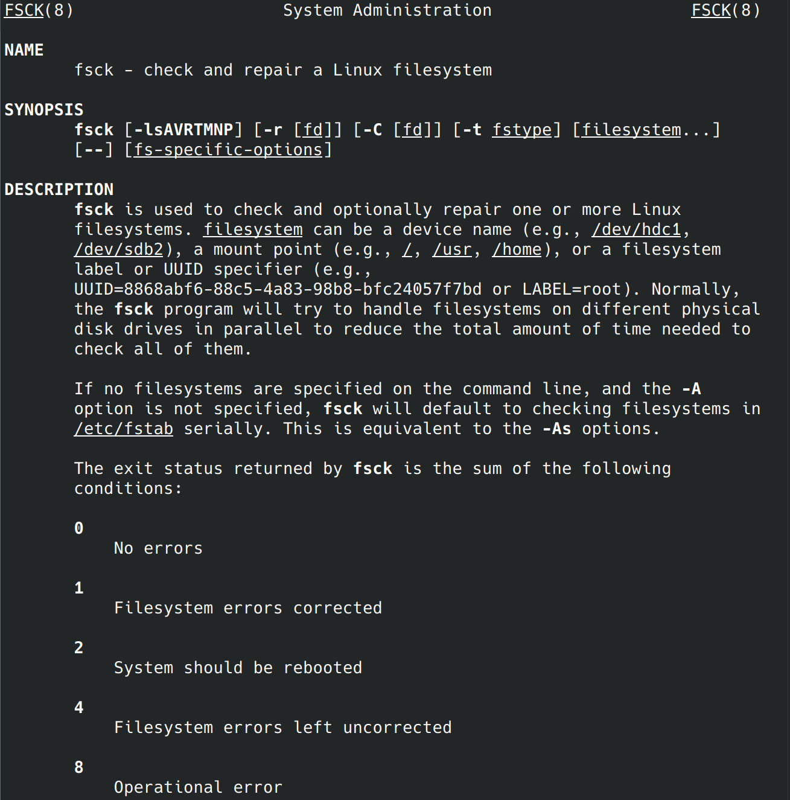{#fig:012 width=100%}

С помощью команды man узнаю характеристики команды mkfs:
Команда mkfs (Make File System) используется для создания новой файловой системы на устройстве. Это позволяет инициализировать диск для использования. Пример использования: mkfs.ext4 /dev/sdc1
Эта команда создает файловую систему ext4 на устройстве /dev/sdc1.

(рис. [-@fig:013]).

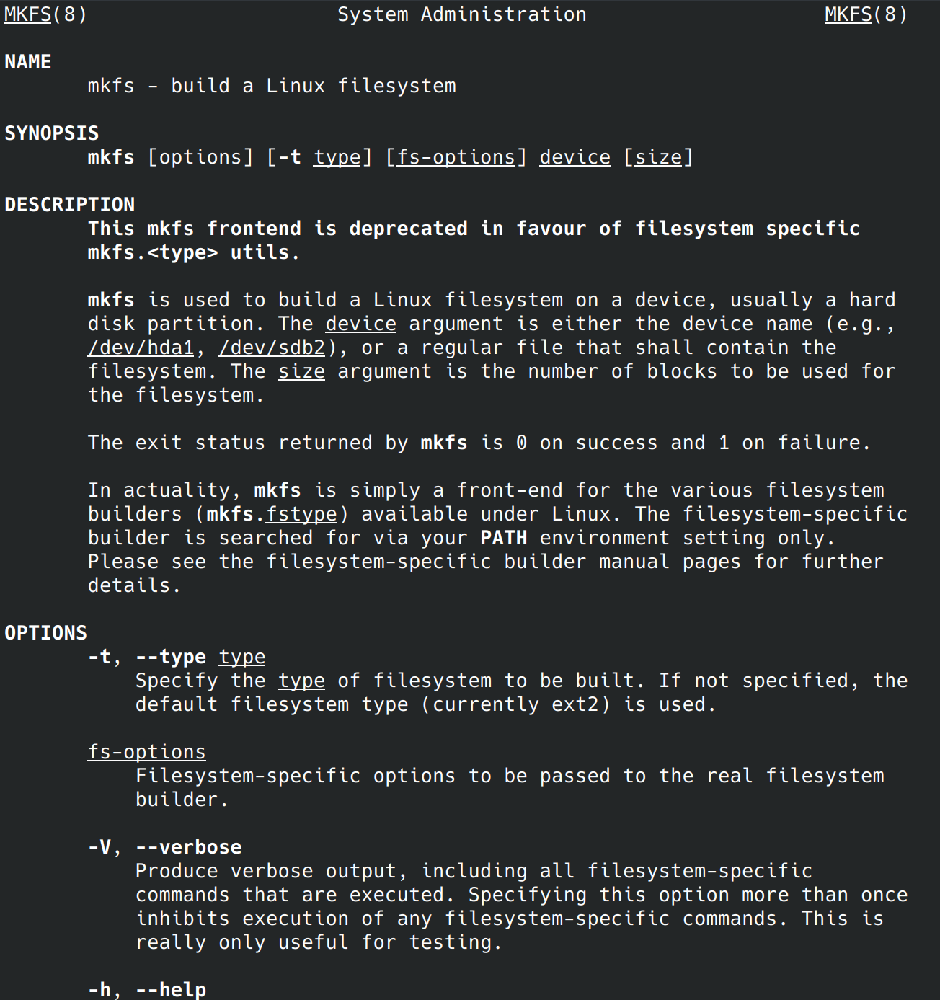{#fig:013 width=100%}

С помощью команды man узнаю характеристики команды kill:
Команда kill используется для отправки сигнала процессу или группе процессов для завершения их работы. Это позволяет управлять процессами в системе.
Пример использования: kill -9 1234
Эта команда отправляет сигнал SIGKILL процессу с идентификатором 1234 для принудительного завершения (рис. [-@fig:014]).

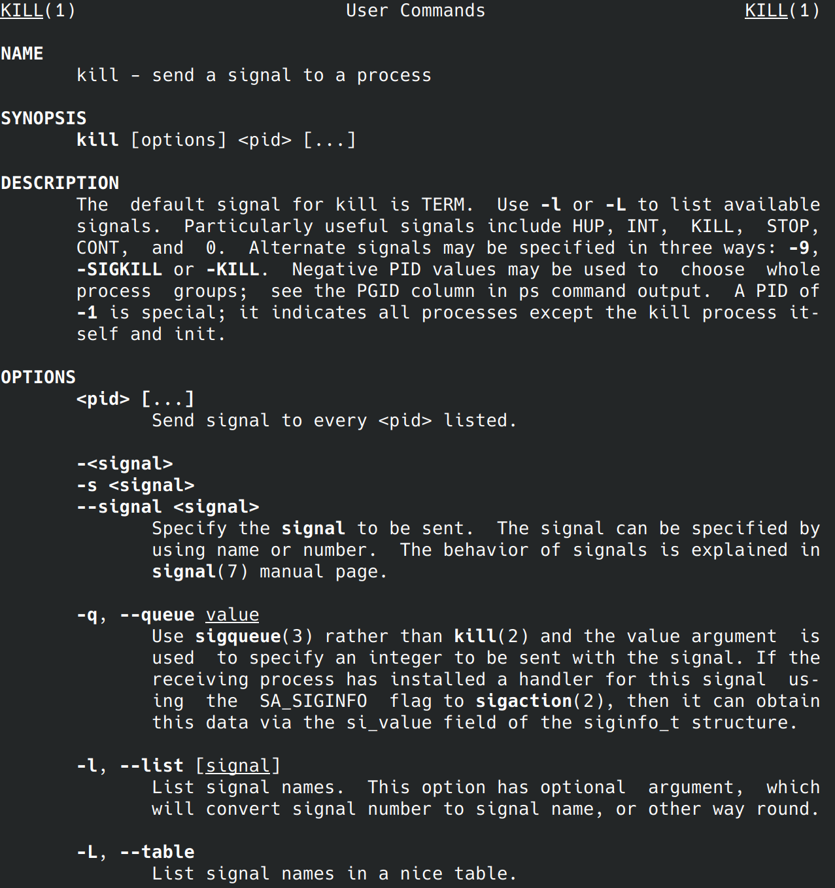{#fig:014 width=100%}

# Выводы

В ходе выполнения лабороторной работы я ознакомилась с файловой системой Linux, её структурой, именами и содержанием
каталогов, приобрела практические навыки по применению команд для работы
с файлами и каталогами, по управлению процессами (и работами), по проверке использования диска и обслуживанию файловой системы.

