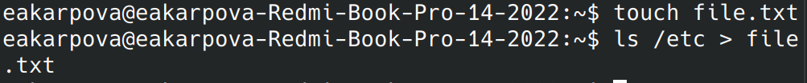
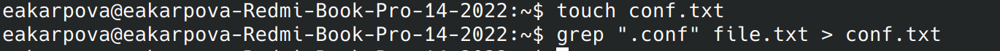
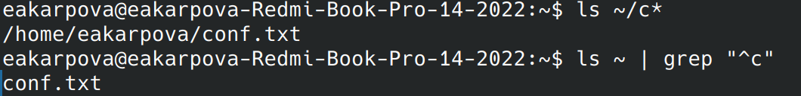
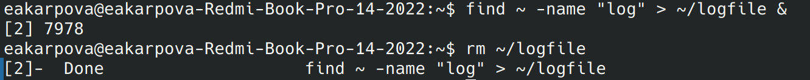
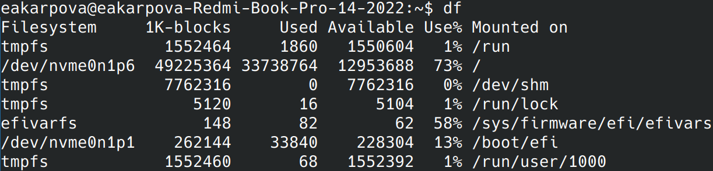

---
## Front matter
lang: ru-RU
title: Laboratory work No. 8
subtitle:
author:
  - Karpova E.A.
institute:
  - Peoples' Friendship University of Russia, Moscow, Russia
date: 24.03.2024

## i18n babel
babel-lang: russian
babel-otherlangs: english

## Formatting pdf
toc: false
toc-title: Contents
slide_level: 2
aspectratio: 169
section-titles: true
theme: metropolis
header-includes:
 - \metroset{progressbar=frametitle,sectionpage=progressbar,numbering=fraction}
 - '\makeatletter'
 - '\beamer@ignorenonframefalse'
 - '\makeatother'
---

# Information

## Speaker

  * Karpova Esenia Alexkseevna
  * student NKAbd-02-23
  * faculty of physicks and mathematics
  * PFUR
  * [1132236008@pfur.ru](mailto:1132236008@pfur.ru)
  * <https://github.com/eakarpova>

# Introductory part

## Aims

- Familiarization with file search and text data filtering tools

- Acquisition of practical skills: process (and task) management, disk utilization checking and file system maintenance.
Checking disk usage and maintaining file systems.

# Tasks

1. Using commands to search and filter files

2. Developing practical skills in process management

# Performing laboratory work

## Writing files from the home directory

## Writing files with .conf resolution

## Output files with the letter "s"

## Running a process in the background

## Executing the df command

# Results

Gained practical skills in working with:

- conveyors

- file search

- text filtering
disk usage check

- task management

- process information
