---
## Front matter
title: "Лабораторная работа №8"
subtitle: "Поиск файлов. Перенаправление
ввода-вывода. Просмотр запущенных процессов"
author: "Карпова Есения Алексеевна"

## Generic otions
lang: ru-RU
toc-title: "Содержание"

## Bibliography
bibliography: bib/cite.bib
csl: pandoc/csl/gost-r-7-0-5-2008-numeric.csl

## Pdf output format
toc: true # Table of contents
toc-depth: 2
lof: true # List of figures
lot: true # List of tables
fontsize: 12pt
linestretch: 1.5
papersize: a4
documentclass: scrreprt
## I18n polyglossia
polyglossia-lang:
  name: russian
  options:
	- spelling=modern
	- babelshorthands=true
polyglossia-otherlangs:
  name: english
## I18n babel
babel-lang: russian
babel-otherlangs: english
## Fonts
mainfont: PT Serif
romanfont: PT Serif
sansfont: PT Sans
monofont: PT Mono
mainfontoptions: Ligatures=TeX
romanfontoptions: Ligatures=TeX
sansfontoptions: Ligatures=TeX,Scale=MatchLowercase
monofontoptions: Scale=MatchLowercase,Scale=0.9
## Biblatex
biblatex: true
biblio-style: "gost-numeric"
biblatexoptions:
  - parentracker=true
  - backend=biber
  - hyperref=auto
  - language=auto
  - autolang=other*
  - citestyle=gost-numeric
## Pandoc-crossref LaTeX customization
figureTitle: "Рис."
tableTitle: "Таблица"
listingTitle: "Листинг"
lofTitle: "Список иллюстраций"
lotTitle: "Список таблиц"
lolTitle: "Листинги"
## Misc options
indent: true
header-includes:
  - \usepackage{indentfirst}
  - \usepackage{float} # keep figures where there are in the text
  - \floatplacement{figure}{H} # keep figures where there are in the text
---

# Цель работы

Ознакомление с инструментами поиска файлов и фильтрации текстовых данных.
Приобретение практических навыков: по управлению процессами (и заданиями), по
проверке использования диска и обслуживанию файловых систем.

# Задание

1. Применение команд по поиску и фильтрации файлов

2. Развитие практических навыков по управлению процессами

# Теоретическое введение

## Конвейеры

Конвейеры можно группировать в цепочки и выводить с помощью перенаправления
в файл, например:

    ls -la |sort > sortilg_list

## Поиск файла

Команда find используется для поиска и отображения на экран имён файлов, соответствующих заданной строке символов.
Формат команды:

    find путь [-опции]

Путь определяет каталог, начиная с которого по всем подкаталогам будет вестись
поиск.

## Фильтрация текста

Найти в текстовом файле указанную строку символов позволяет команда grep.
Формат команды:

    grep строка имя_файла

Кроме того, команда grep способна обрабатывать стандартный вывод других команд (любой текст). Для этого следует использовать конвейер, связав вывод команды с вводом
grep.

## Проверка использования диска

Команда df показывает размер каждого смонтированного раздела диска.
Формат команды:

    df [-опции] [файловая_система]

Команда du показывает число килобайт, используемое каждым файлом или каталогом.
Формат команды:

    du [-опции] [имя_файла...]

## Управление задачами

Любую выполняющуюся в консоли команду или внешнюю программу можно запустить
в фоновом режиме. Для этого следует в конце имени команды указать знак амперсанда &.
Например:

    gedit &

Будет запущен текстовой редактор gedit в фоновом режиме. Консоль при этом не будет заблокирована.
Запущенные фоном программы называются задачами (jobs). Ими можно управлять с помощью команды jobs, которая выводит список запущенных в данный момент задач.
Для завершения задачи необходимо выполнить команду

    kill %номер задачи

## Получение информации о процессах

Команда ps используется для получения информации о процессах.
Формат команды:

    ps [-опции]

Для получения информации о процессах, управляемых вами и запущенных (работающих или остановленных) на вашем терминале, используйте опцию aux.

# Выполнение лабораторной работы

1. Применение команд по поиску и фильтрации файлов

Создаю файл с помощью команды touch и записываю в него названия файлов, содержащихся в домашнем каталоге через команду ls (рис. [-@fig:001]).

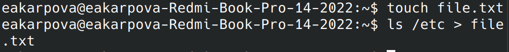{#fig:001 width=100%}

Проверяю корректность выполения команды и открываю указанный файл (рис. [-@fig:002]).

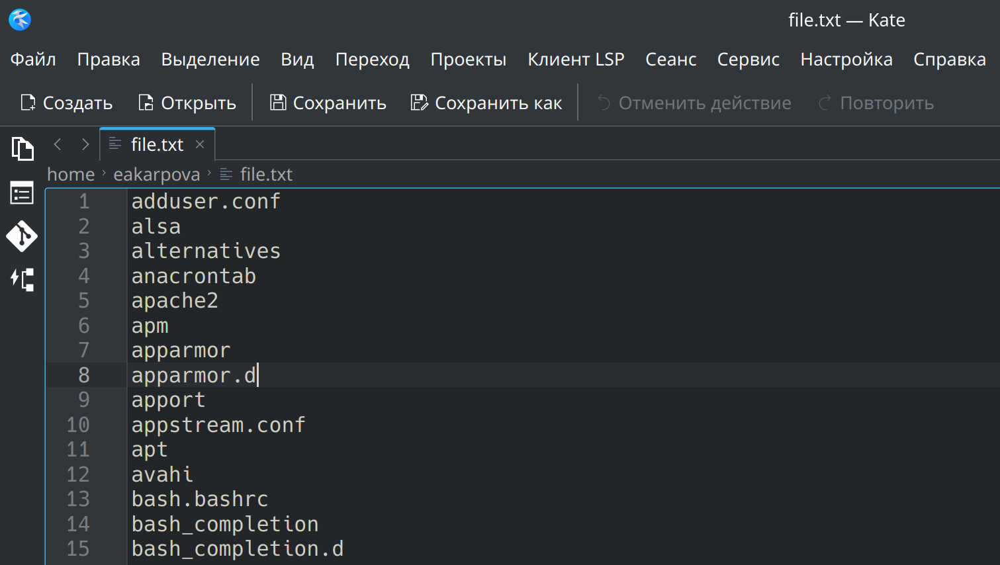{#fig:002 width=100%}

С помощью команды ls дописываю в этот же файл названия документов, содержащихся в домашнем каталоге (рис. [-@fig:003]).

{#fig:003 width=100%}

Проверяю корректность выполения команды и открываю указанный файл (рис. [-@fig:004]).

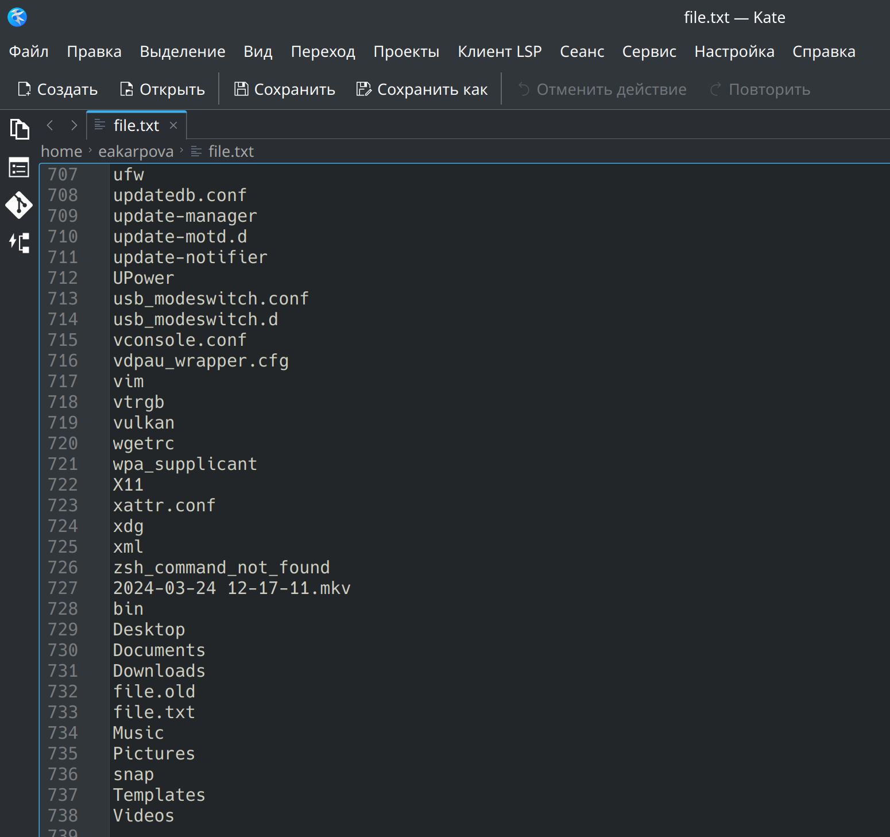{#fig:004 width=100%}

Создаю новый файл conf.txt и записываю в него имена всех файлов из file.txt имеющих разрешение .conf (рис. [-@fig:005]).

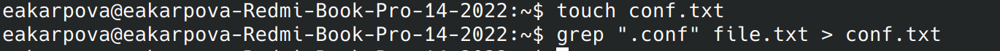{#fig:005 width=100%}

Проверяю корректность выполения команды и открываю указанный файл (рис. [-@fig:006]).

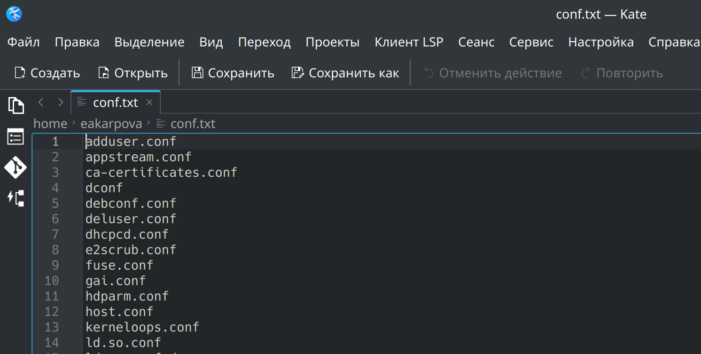{#fig:006 width=100%}

Вывожу файлы домашней директории, начинающиеся с символа "с". Это можно сделать двумя способами: через команду ls и с помощью ковейера ls и grep (рис. [-@fig:007]).

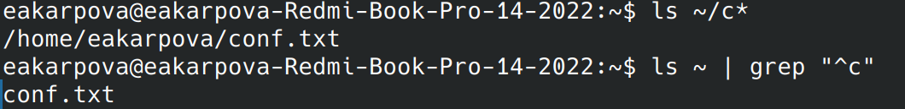{#fig:007 width=100%}

Вывожу на экран имена файлов из каталога /etc, начинающиеся на символ "h" с помощью команды ls (рис. [-@fig:008]).

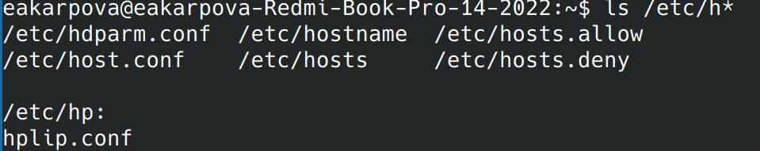{#fig:008 width=100%}

2. Развитие практических навыков по управлению процессами

Запускаю в фоновом режиме процесс, который будет записывать в файл ~/logfile файлы, имена которых начинаются с log. Затем удаляю файл, в котором шел процесс, тем самым завершаю его (рис. [-@fig:009]).

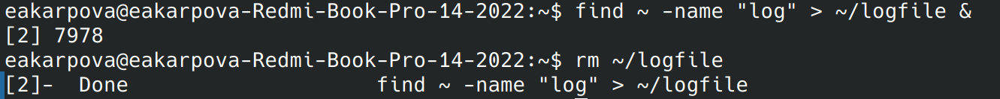{#fig:009 width=100%}

Запускаю из консоли в фоном режиме gedit, который открывается в отдельном окне (рис. [-@fig:010]).

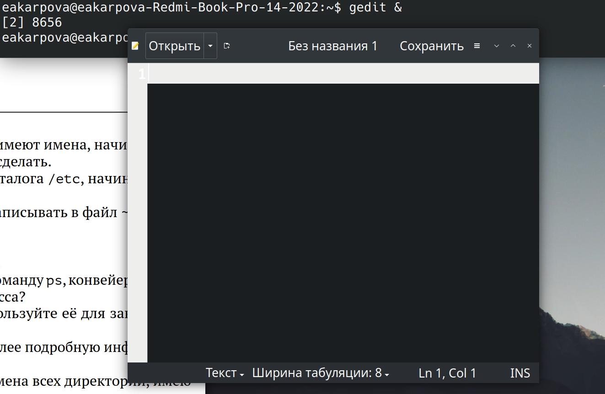{#fig:010 width=100%}

Определяю идентификатор процесса gedit, используя команду ps, конвейер и фильтр grep. Иначе это можно было сделать с помощью команды grep (рис. [-@fig:011]).

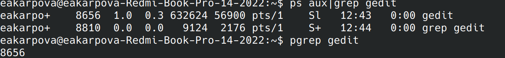{#fig:011 width=100%}

Использую команду kill для завершения процесса через его идентификатор (рис. [-@fig:012]).

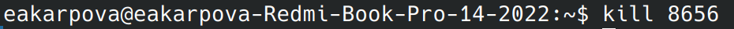{#fig:012 width=100%}

Выполняю команду df(рис. [-@fig:013]).

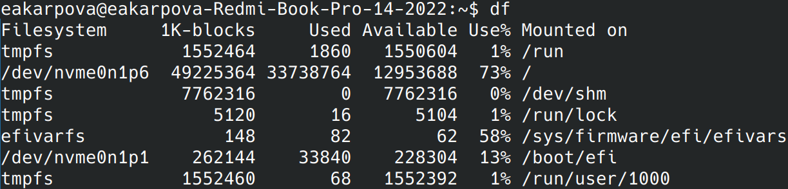{#fig:013 width=100%}

Выполняю команду du (рис. [-@fig:014]).

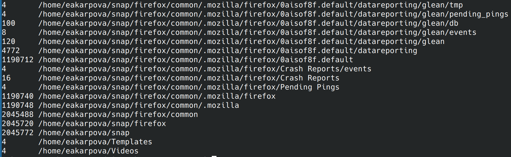{#fig:014 width=100%}

С помощью команды find вывожу имена всех директорий, имею-
щихся в вашем домашнем каталоге (рис. [-@fig:015]).

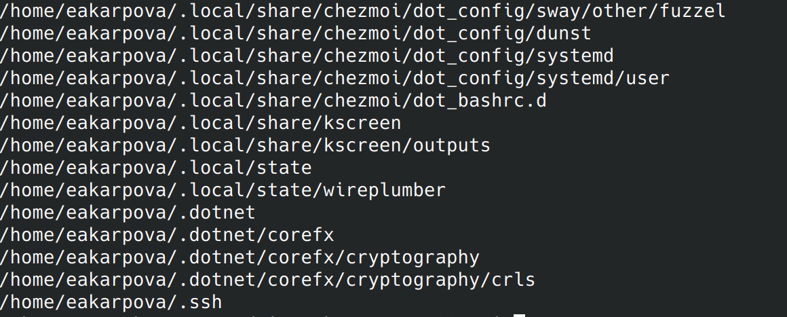{#fig:015 width=100%}

# Контрольные вопросы

1. Потоки ввода-вывода (потоки ввода-вывода): К потокам ввода-вывода относятся stdin (стандартный поток ввода), stdout (стандартный поток вывода) и stderr (стандартный поток ошибок). Эти потоки используются для операций ввода и вывода в системе.

2. Разница между операциями > и >> (Разница между операциями > и >>): Операция ">" используется для перенаправления стандартного вывода в файл, создавая или перезаписывая его, если он существует. Операция ">>", напротив, используется для добавления стандартного вывода в файл, создавая его, если он не существует, или добавляя к нему, если он существует.

3. Конвейер (Pipeline): Конвейер используется для соединения простых команд или утилит в цепочки, где выход одной команды передается в качестве входа следующей. Он обозначается символом "|".

4. Процесс против программы: Процесс - это экземпляр выполняющейся программы с собственным пространством памяти и системными ресурсами, а программа - это набор инструкций, хранящихся в файле. Процесс - это выполнение программы в операционной системе.

5. PID и GID: PID (Process ID) - это уникальный идентификационный номер, присваиваемый каждому процессу в системе, а GID (Group ID) - уникальный идентификационный номер, присваиваемый каждой группе пользователей в системе.

6. Задачи и команды для управления задачами: Задания - это программы или команды, выполняющиеся в фоновом режиме. Управлять ими можно с помощью команды "jobs" для получения списка запущенных задач и команды "kill %task_number" для завершения задачи.

7. Функции утилит top и htop: Утилиты "top" и "htop" используются для мониторинга системных процессов, использования ресурсов и обеспечивают интерактивный просмотр процессов с более широкими возможностями, чем стандартная команда "top".

8. Команда для поиска файлов: Команда "find" используется для поиска и отображения имен файлов, соответствующих заданной строке символов. Поиск ведется начиная с указанного каталога по всем подкаталогам. Примеры ее использования приведены в файле.

9. Поиск файла по контексту: Да, файл можно найти по его содержимому с помощью команды "grep", которая позволяет искать определенные строки в файлах или выводах других команд.

10. Определение свободного места на диске: Команда "df" показывает размер каждого смонтированного раздела диска, предоставляя информацию об использовании диска. Она помогает определить свободное пространство на жестком диске.

11. Определение размера домашней директории:  Команда "du" показывает количество килобайт, используемых каждым файлом или каталогом. Указав домашний каталог, можно определить его размер.

12. Удаление зависшего процесса: Зависший процесс можно завершить с помощью команды "kill", за которой следует идентификатор процесса (PID), который необходимо остановить.

# Выводы

В ходе выполнения лабораторной работы я ознакомилась  с инструментами поиска файлов и фильтрации текстовых данных, и приобрела практические навыки: по управлению процессами (и заданиями), по проверке использования диска и обслуживанию файловых систем.
