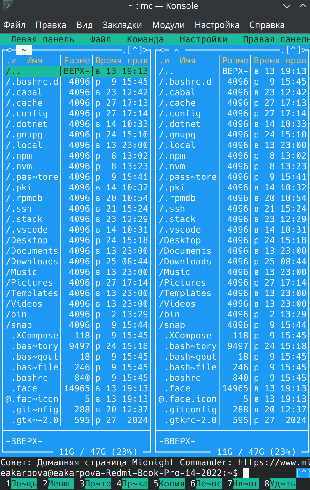
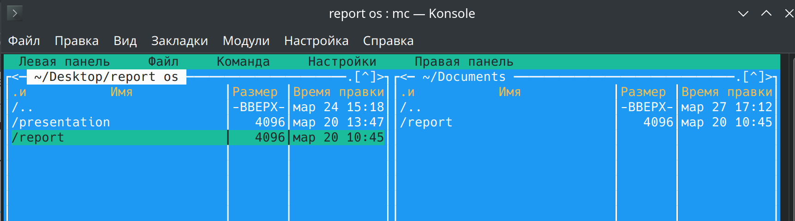
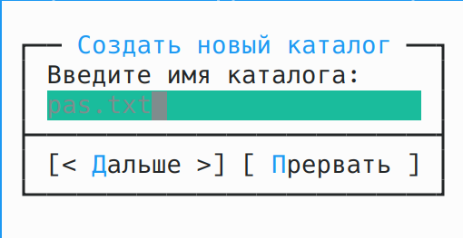
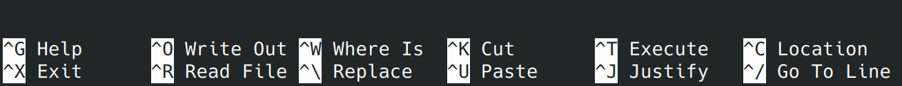
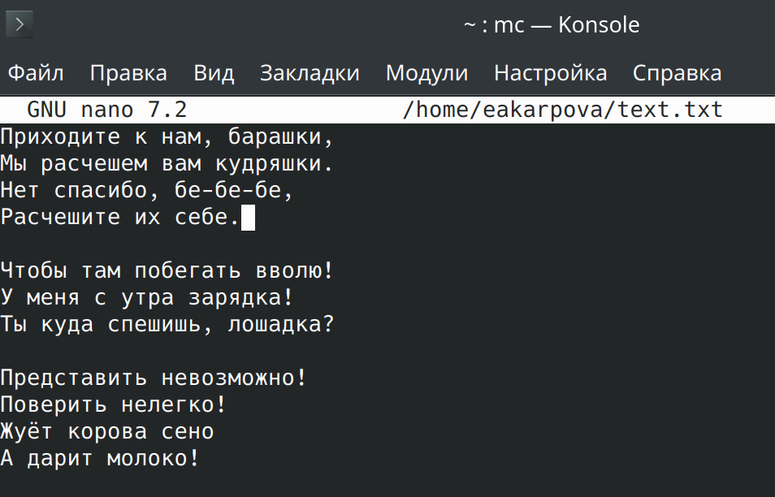

---
## Front matter
lang: ru-RU
title: Laboratory work No.
subtitle:
author:
  - Karpova E.A.
institute:
  - Peoples' Friendship University of Russia, Moscow, Russia
date:

## i18n babel
babel-lang: russian
babel-otherlangs: english

## Formatting pdf
toc: false
toc-title: Contents
slide_level: 2
aspectratio: 169
section-titles: true
theme: metropolis
header-includes:
 - \metroset{progressbar=frametitle,sectionpage=progressbar,numbering=fraction}
 - '\makeatletter'
 - '\beamer@ignorenonframefalse'
 - '\makeatother'
---

# Information

## Speaker

  * Karpova Esenia Alexkseevna
  * student NKAbd-02-23
  * faculty of physicks and mathematics
  * PFUR
  * [1132236008@pfur.ru](mailto:1132236008@pfur.ru)
  * <https://github.com/eakarpova>

# Introductory part

## Aims

- Mastering the main features of the Midnight Commander shell.
- Acquisition of skills of practical work on viewing directories and files; manipulations with them

## Tasks

1. Complete the mc assignment

2. Perform a task on the built-in mc editor

# Performing laboratory work

## Starting mc

## File copying

## Catalog creation

## Hotkeys

## Adding text

# Results

I have mastered the basic features of the Midnight Commander command shell
