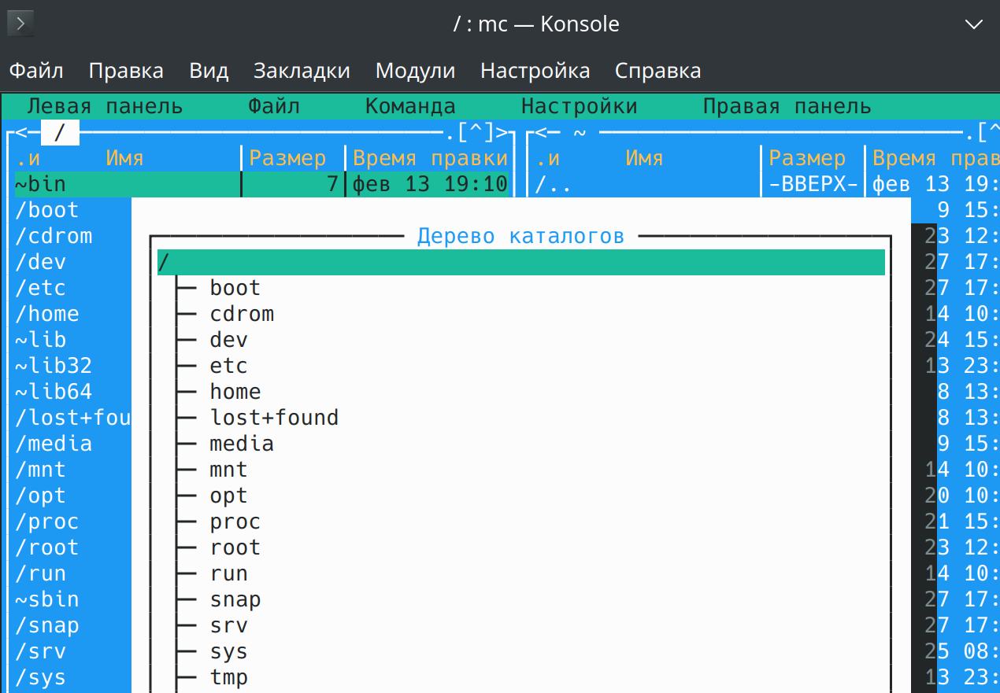
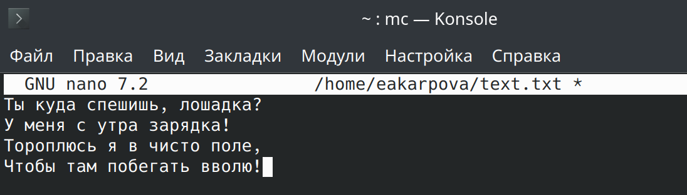

---
## Front matter
title: "Лабораторная работа №9"
subtitle: "Командная оболочка Midnight Commander"
author: "Карпова Есения Алексеевна"

## Generic otions
lang: ru-RU
toc-title: "Содержание"

## Bibliography
bibliography: bib/cite.bib
csl: pandoc/csl/gost-r-7-0-5-2008-numeric.csl

## Pdf output format
toc: true # Table of contents
toc-depth: 2
lof: true # List of figures
lot: true # List of tables
fontsize: 12pt
linestretch: 1.5
papersize: a4
documentclass: scrreprt
## I18n polyglossia
polyglossia-lang:
  name: russian
  options:
	- spelling=modern
	- babelshorthands=true
polyglossia-otherlangs:
  name: english
## I18n babel
babel-lang: russian
babel-otherlangs: english
## Fonts
mainfont: PT Serif
romanfont: PT Serif
sansfont: PT Sans
monofont: PT Mono
mainfontoptions: Ligatures=TeX
romanfontoptions: Ligatures=TeX
sansfontoptions: Ligatures=TeX,Scale=MatchLowercase
monofontoptions: Scale=MatchLowercase,Scale=0.9
## Biblatex
biblatex: true
biblio-style: "gost-numeric"
biblatexoptions:
  - parentracker=true
  - backend=biber
  - hyperref=auto
  - language=auto
  - autolang=other*
  - citestyle=gost-numeric
## Pandoc-crossref LaTeX customization
figureTitle: "Рис."
tableTitle: "Таблица"
listingTitle: "Листинг"
lofTitle: "Список иллюстраций"
lotTitle: "Список таблиц"
lolTitle: "Листинги"
## Misc options
indent: true
header-includes:
  - \usepackage{indentfirst}
  - \usepackage{float} # keep figures where there are in the text
  - \floatplacement{figure}{H} # keep figures where there are in the text
---

# Цель работы

Освоение основных возможностей командной оболочки Midnight Commander. Приоб-
ретение навыков практической работы по просмотру каталогов и файлов; манипуляций
с ними

# Задание

1. Выполнить задание по mc

2. Выполнить задание по встроенному редактору mc

# Теоретическое введение

Командная оболочка — интерфейс взаимодействия пользователя с операционной системой и программным обеспечением посредством команд.
Midnight Commander (или mc) — псевдографическая командная оболочка для UNIX/Linux систем. Для запуска mc необходимо в командной строке набрать mc и нажать
Рабочее пространство mc имеет две панели, отображающие по умолчанию списки файлов двух каталогов

Панель в mc отображает список файлов текущего каталога. Абсолютный путь к этому
каталогу отображается в заголовке панели. У активной панели заголовок и одна из её
строк подсвечиваются. Управление панелями осуществляется с помощью определённых
комбинаций клавиш или пунктов меню mc.

Встроенный в mc редактор вызывается с помощью функциональной клавиши F4. В нём
удобно использовать различные комбинации клавиш при редактировании содержимого (как правило текстового) файла

# Выполнение лабораторной работы

1. Выполнить задание по mc

C помощью команды man изучаю информацию о mc (рис. [-@fig:001]).

{#fig:001 width=100%}

Запускаю из командной строки mc с помощью одноименной команде, изучаю его структуру и меню (рис. [-@fig:002]).

{#fig:002 width=100%}

С помощью управляющих клавиш выполняю несколько операций в mc (выделение/отмена выделения файлов, копирование/перемещение фай-
лов, получение информации о размере и правах доступа на файлы и/или каталоги
и т.п.). Пример работы с управляющими клавишами - копирование файла (рис. [-@fig:003]).

{#fig:003 width=100%}

Выполняю основные команды меню левой панели. Информация достаточно подробная, 6.3/10 (рис. [-@fig:004]).

{#fig:004 width=100%}

Используя возможности подменю "Файл" просматриваю содержимое текстового файла (рис. [-@fig:005]).

{#fig:005 width=100%}

Редактирование содержимого текстового файла без сохранения результатов редактирования (рис. [-@fig:006]).

{#fig:006 width=100%}

Произвожу создание каталога (рис. [-@fig:007]).

{#fig:007 width=100%}

Копирование файлов в созданный каталог(рис. [-@fig:008]).

{#fig:008 width=100%}

С помощью соответствующих средств подменю "Команда" осуществляю поиск в файловой системе файла с заданными условиями (рис. [-@fig:009]).

{#fig:009 width=100%}

Перехожу в домашний каталог (рис. [-@fig:010]).

{#fig:010 width=100%}

Вызываю подменю "Настройки". Осваиваю операции, определяющие структуру экрана mc (рис. [-@fig:011]).

{#fig:011 width=100%}

2. Выполнить задание по встроенному редактору mc

Создаю текстовый файл с помощью утилиты touch и открываю с помощью встроенного редактора mc. Вставляю в открытый файл небольшой фрагмент текста из интернета (рис. [-@fig:012]).

{#fig:012 width=100%}

Список работающих у меня горячих клавиш немного отличается от тех, что изложены в тексте лабораторной работы (рис. [-@fig:013]).

{#fig:013 width=100%}

Удаляю строку текста (рис. [-@fig:014]).

{#fig:014 width=100%}

Выделяю фрагмент текста с помощью shift и копирую его на новую строку через сочетание клавиш ctrl+C
(рис. [-@fig:015]).

{#fig:015 width=100%}

Сохраняю файл, отменяю последнее действие и добавляю в конец и начало файла разный текст, после чего сохраняю и закрываю его (рис. [-@fig:016]).

{#fig:016 width=100%}

# Выводы

В ходе лабораторной работы я освоила основные возможности командной оболочки Midnight Commander. Приобретела навыки практической работы по просмотру каталогов и файлов; манипуляций
с ними
