---
## Front matter
title: "Индивидуальный проект"
subtitle: "Этап 1"
author: "Карпова Есения Алексеевна"

## Generic otions
lang: ru-RU
toc-title: "Содержание"

## Bibliography
bibliography: bib/cite.bib
csl: pandoc/csl/gost-r-7-0-5-2008-numeric.csl

## Pdf output format
toc: true # Table of contents
toc-depth: 2
lof: true # List of figures
lot: true # List of tables
fontsize: 12pt
linestretch: 1.5
papersize: a4
documentclass: scrreprt
## I18n polyglossia
polyglossia-lang:
  name: russian
  options:
	- spelling=modern
	- babelshorthands=true
polyglossia-otherlangs:
  name: english
## I18n babel
babel-lang: russian
babel-otherlangs: english
## Fonts
mainfont: PT Serif
romanfont: PT Serif
sansfont: PT Sans
monofont: PT Mono
mainfontoptions: Ligatures=TeX
romanfontoptions: Ligatures=TeX
sansfontoptions: Ligatures=TeX,Scale=MatchLowercase
monofontoptions: Scale=MatchLowercase,Scale=0.9
## Biblatex
biblatex: true
biblio-style: "gost-numeric"
biblatexoptions:
  - parentracker=true
  - backend=biber
  - hyperref=auto
  - language=auto
  - autolang=other*
  - citestyle=gost-numeric
## Pandoc-crossref LaTeX customization
figureTitle: "Рис."
tableTitle: "Таблица"
listingTitle: "Листинг"
lofTitle: "Список иллюстраций"
lotTitle: "Список таблиц"
lolTitle: "Листинги"
## Misc options
indent: true
header-includes:
  - \usepackage{indentfirst}
  - \usepackage{float} # keep figures where there are in the text
  - \floatplacement{figure}{H} # keep figures where there are in the text
---

# Цель работы

Научиться размещать сайт на GitHub pages

# Задание

1. Установить необходимое программное обеспечение.
2. Скачать шаблон темы сайта.
3. Разместить его на хостинге git.
4. Установить параметр для URLs сайта.
5. Разместить заготовку сайта на Github pages.

# Выполнение индивидуального проекта

1. Установка необходимого ПО

Скачиваем последнюю версию исполняемого файла hugo для своей ОС и распаковываем архив с исполняемым файлом (рис. [-@fig:001]).

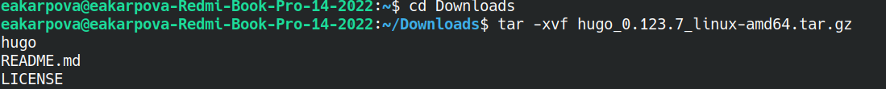{#fig:001 width=100%}

Создаю в домашнем каталоге пустую папку bin и переношу в нее исполняемый файл (рис. [-@fig:002]).

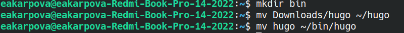{#fig:002 width=100%}

2. Скачивание шаблона темы сайта

Открываю репозиторий с шаблоном темы сайта и создаю на его основе своей репозиторий website (рис. [-@fig:003]).

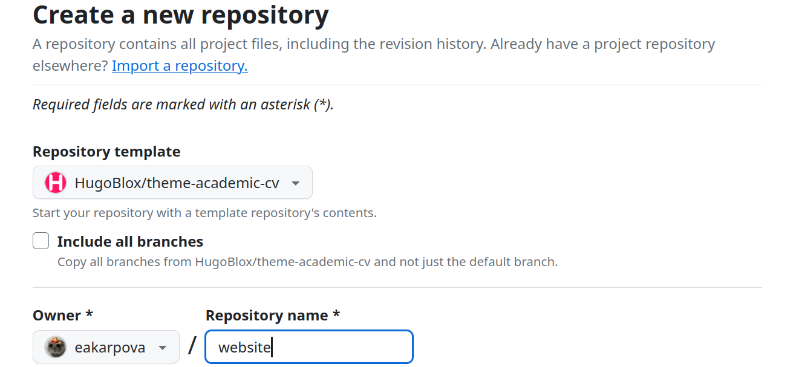{#fig:003 width=100%}

Клонирую созданный репозиторий к себе в локальный репозиторий (рис. [-@fig:004]).

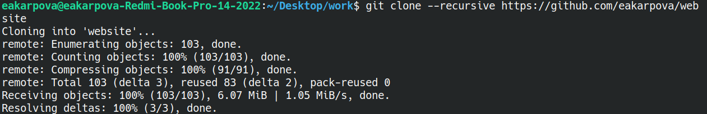{#fig:004 width=100%}

3. Размещение его на хостинге git

Запускаю исполняемый файл (рис. [-@fig:005]).

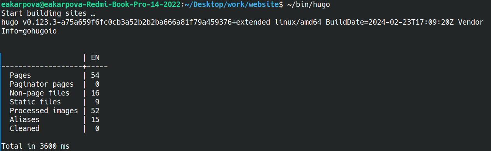{#fig:005 width=100%}

Запускаю исполняемый файл с командой server (рис. [-@fig:006]).

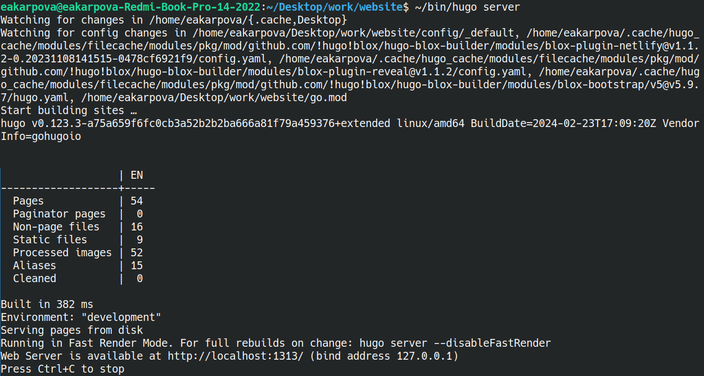{#fig:006 width=100%}

Перехожу на страницу сайта на локальном сервере (рис. [-@fig:007]).

{#fig:007 width=100%}

4. Установка параметра для URLs сайта

Создаю новый пустой репозиторий, чье имя будет адресом сайта (рис. [-@fig:008]).

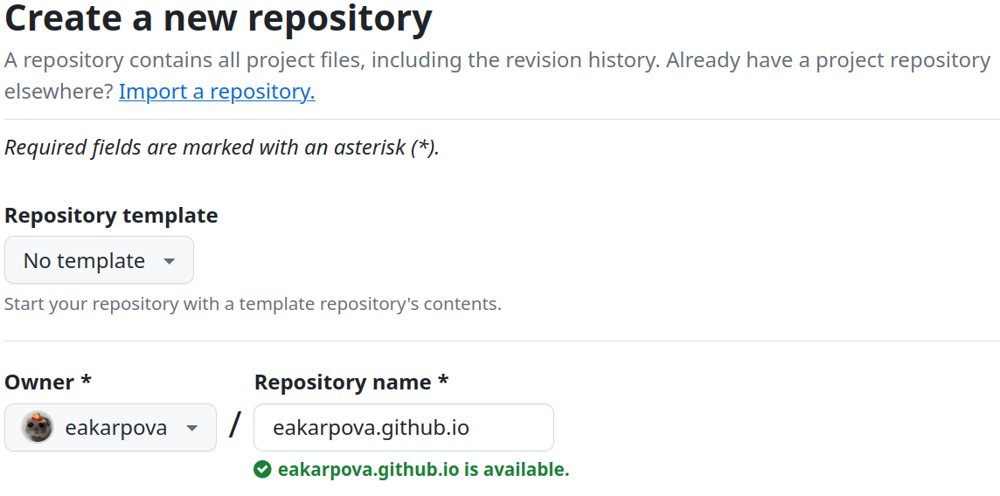{#fig:008 width=100%}

Клонирую созданный репозиторий, чтобы создать локальный репозиторий на своем компьютере (рис. [-@fig:009]).

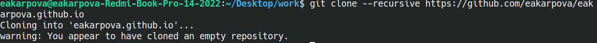{#fig:009 width=100%}

Создаю главную ветку с именем main (рис. [-@fig:010]).

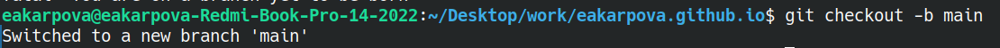{#fig:010 width=100%}

Создаю пустой файл READme.md и отправляю изменения на глобальный репозиторий, чтобы его активировать (рис. [-@fig:011]).

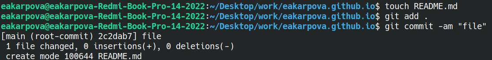{#fig:011 width=100%}

Подключив репозиторий к каталогу public (предварительно отключив в файле gitignore public), снова выполняю команду исполняемого файла, чтобы заполнить создавшийся каталог public (рис. [-@fig:012]).

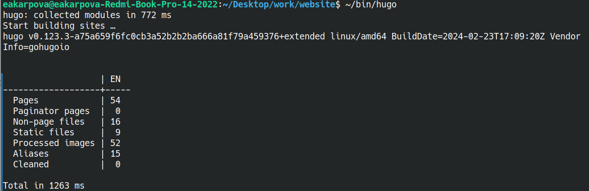{#fig:012 width=100%}

5. Размещение заготовки сайта на GitHub pages

Проверяю, есть ли подключение между public и моим репозиторием, после чего отправляю изменения на глобальный репозиторий (рис. [-@fig:013]).

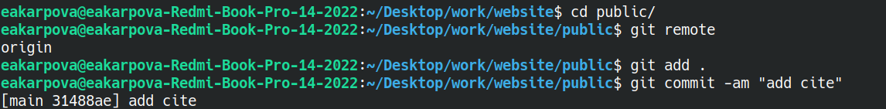{#fig:013 width=100%}

# Выводы

В ходе выполнения лабораторной работы я научилась размещать сайт на Github pages

