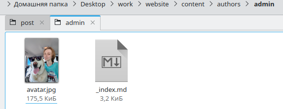
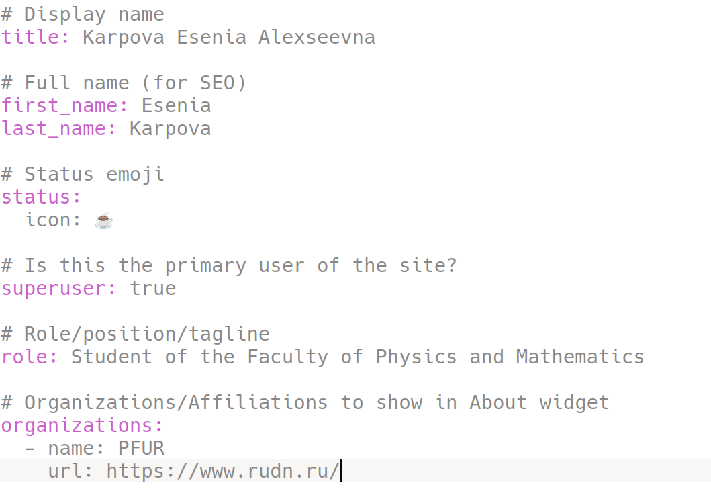
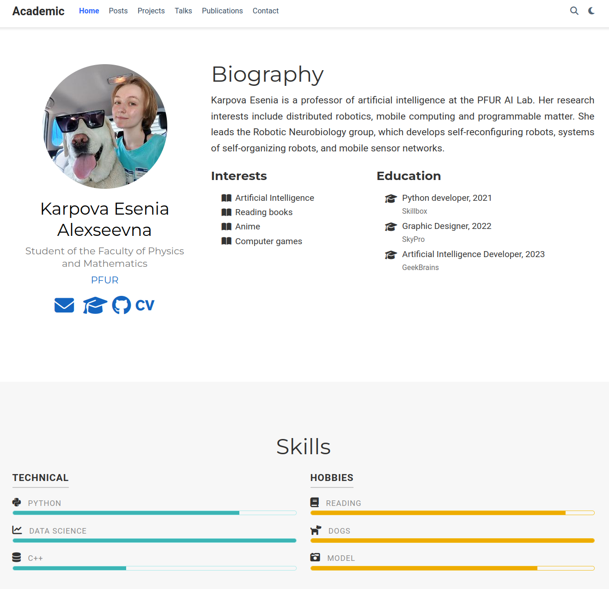
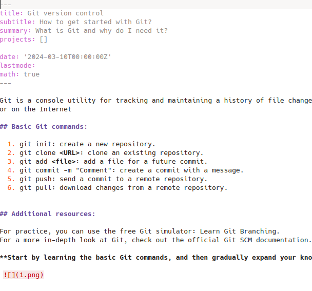
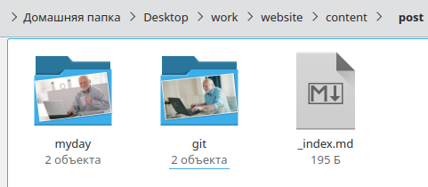
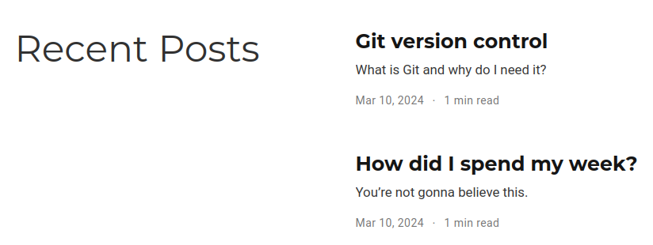
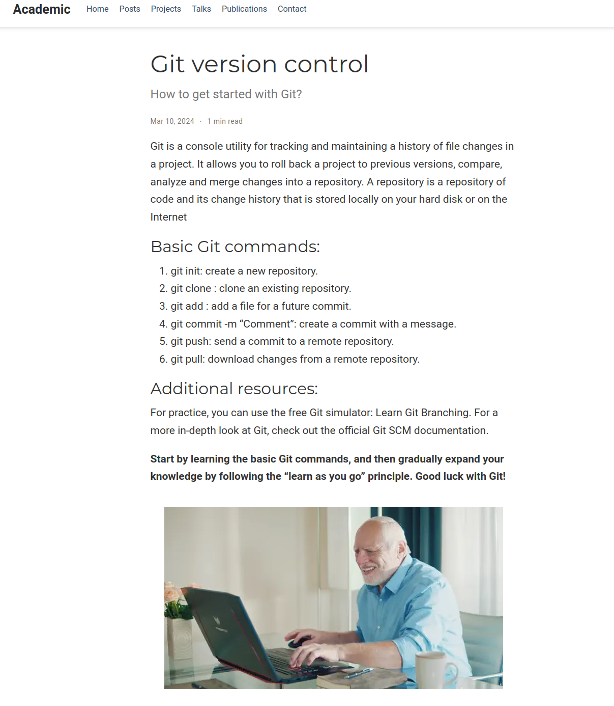

---
## Front matter
lang: ru-RU
title: Personal project
subtitle: Stage 1
author:
  - Karpova E.A.
institute:
   - Peoples' Friendship University of Russia, Moscow, Russia
date: 02 march 2024

## i18n babel
babel-lang: russian
babel-otherlangs: english

## Formatting pdf
toc: false
toc-title: Contents
slide_level: 2
aspectratio: 169
section-titles: true
theme: metropolis
header-includes:
 - \metroset{progressbar=frametitle,sectionpage=progressbar,numbering=fraction}
 - '\makeatletter'
 - '\beamer@ignorenonframefalse'
 - '\makeatother'
---

# Information

## Speaker

:::::::::::::: {.columns align=center}
::: {.column width="70%"}

  * Karpova Esenia Akexkseevna
  * student NKA-bd-02-23
  * Faculty of Physics and Mathematics
  * PFUR
  * [1132236008@pfur.ru](mailto:1132236008@pfur.ru)
  * <https://github.com/eakarpova>

:::
::: {.column width="30%"}

:::
::::::::::::::

# Introductory part

## Relevance

It is useful for a researcher to have a portfolio site about him and his projects

## Objectives

- Learn how to add data about yourself to a website

## Tasks

1. Place a photo of the site owner, a brief description of the site owner (Biography), add information about interests (Interests). and education (Education).

2. Make a post on the past week.
   Add a post on a topic of your choice:
    1) Version control. Git.
    2) Continuous Integration and Continuous Deployment (CI/CD).

# Execution of stage 2 of the individual project

## Placing a photo of the site owner

- Adding my photo to the admin directory

## Posting information about yourself

- Changing my personal information in the _index.md file

## Website

## Post writing

## Location of posts

## Website

## Results

- During the lab work, I learned how to add data about myself to a website.

