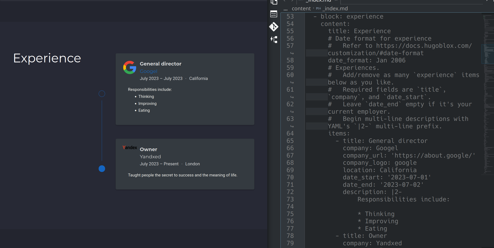
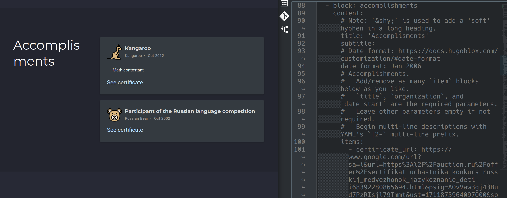
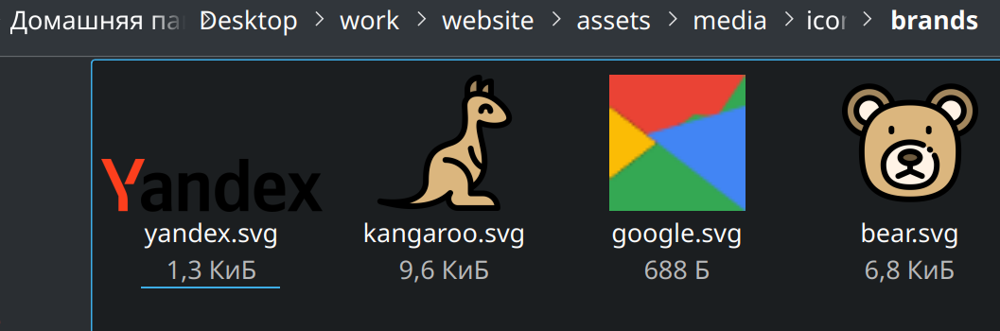
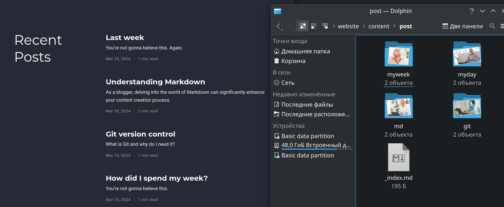
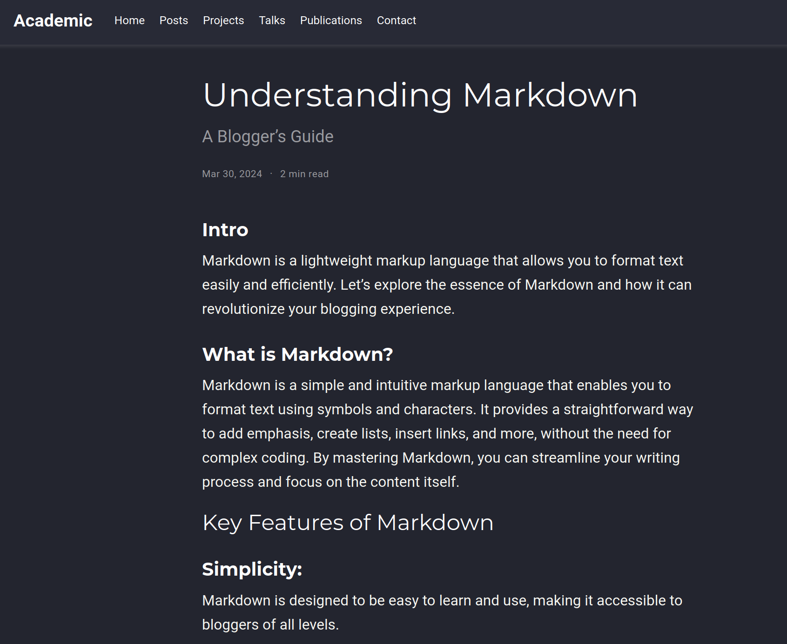

---
## Front matter
lang: ru-RU
title: Individual project
subtitle: Stage 3
author:
  - Karpova E.A.
institute:
  - Peoples' Friendship University of Russia, Moscow, Russia
date:

## i18n babel
babel-lang: russian
babel-otherlangs: english

## Formatting pdf
toc: false
toc-title: Contents
slide_level: 2
aspectratio: 169
section-titles: true
theme: metropolis
header-includes:
 - \metroset{progressbar=frametitle,sectionpage=progressbar,numbering=fraction}
 - '\makeatletter'
 - '\beamer@ignorenonframefalse'
 - '\makeatother'
---

# Information

## Speaker

  * Karpova Esenia Alexkseevna
  * student NKAbd-02-23
  * faculty of physicks and mathematics
  * PFUR
  * [1132236008@pfur.ru](mailto:1132236008@pfur.ru)
  * <https://github.com/eakarpova>

# Introductory part

## Aims

Learn how to add accomplishments to the site.

# Tasks

1) Add a list of achievements:

    - Skills information (Skills).
    - Experience information.
    - Accomplishments information.

2)Make a post on the past week and add a post on a topic of your choice

# Performing laboratory work

## Adding experience information

## Adding achievement information

## Adding images

## Writing posts

## Post about Markdown

# Results

Through lab work, I learned how to add accomplishments to a website.
